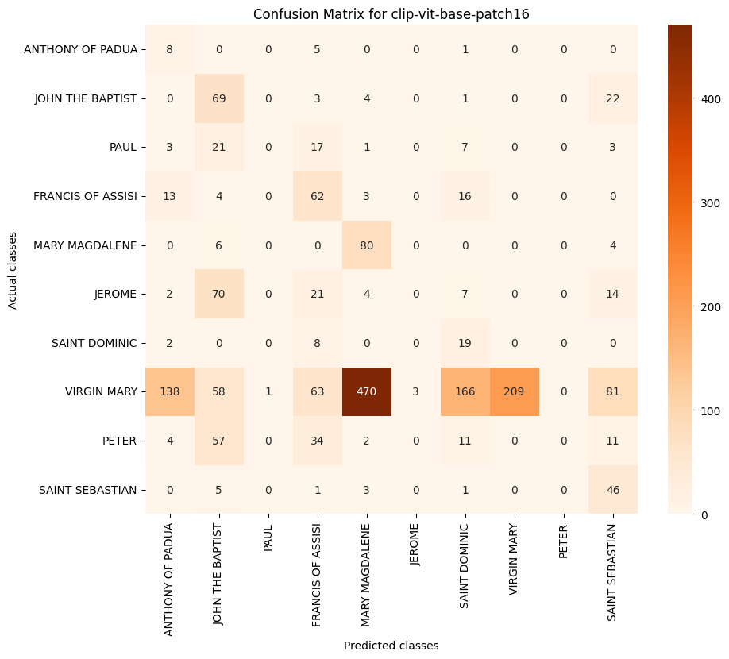
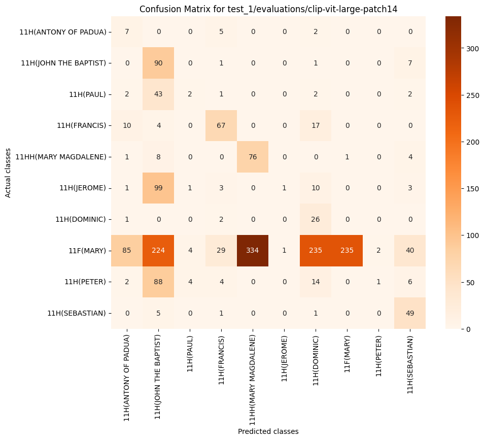
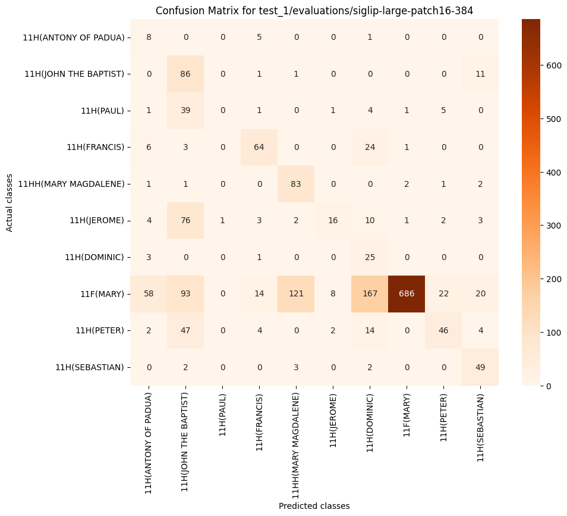
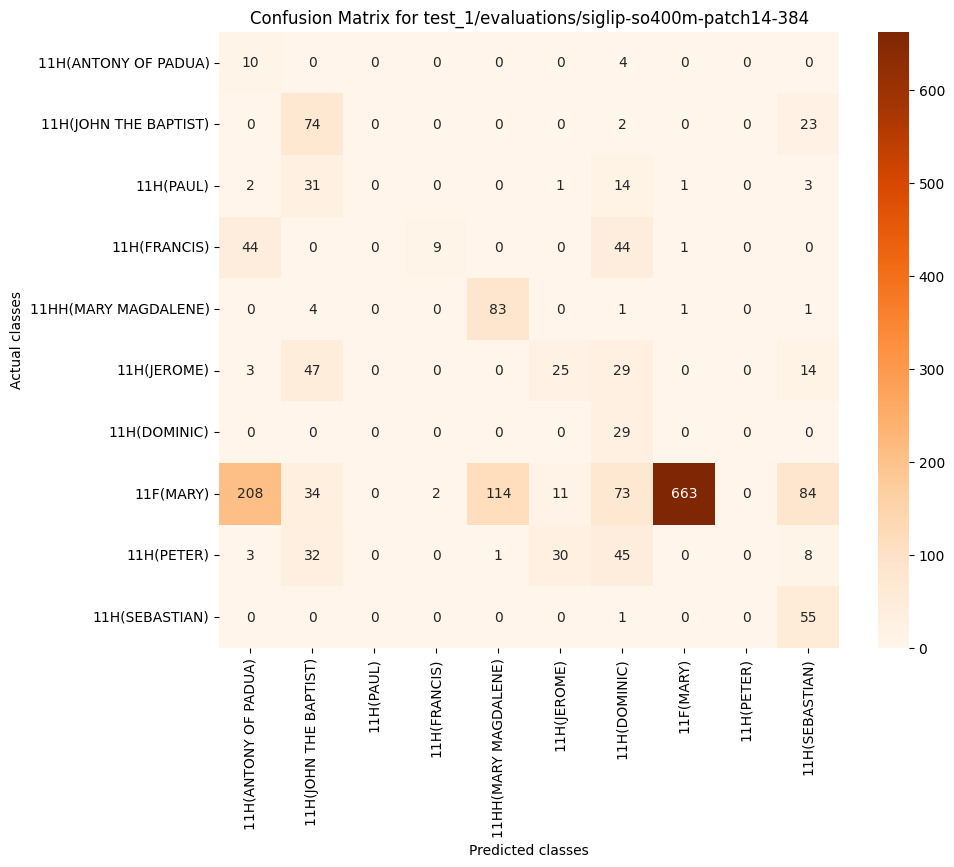

# Zero-shot classification of Christian iconography

This experiment involves the testing of Zero-shot image classification with LLMs, against the performances of a fine-tuned supervised approach. Specifically, we consider as the baseline the results from [1], reported in Tab. 1. 

Describe [1]...

| Class Name           | # Test Images | Precision | Recall  | F1-Score | Average Precision |
|----------------------|---------------|-----------|---------|----------|-------------------|
| Anthony of Padua     | 14            | 72.73%    | 57.14%  | 64.00%   | 64.14%            |
| Francis of Assisi    | 98            | 69.23%    | 82.65%  | 75.35%   | 76.06%            |
| Jerome               | 118           | 70.77%    | 77.97%  | 74.19%   | 78.88%            |
| John the Baptist     | 99            | 58.09%    | 79.80%  | 67.23%   | 75.69%            |
| Mary Magdalene       | 90            | 79.27%    | 72.22%  | 75.58%   | 82.23%            |
| Paul                 | 52            | 54.55%    | 34.62%  | 42.35%   | 38.47%            |
| Peter                | 119           | 72.95%    | 74.79%  | 73.86%   | 77.93%            |
| Saint Dominic        | 29            | 50.00%    | 65.52%  | 56.72%   | 54.35%            |
| Saint Sebastian      | 56            | 91.11%    | 73.21%  | 81.19%   | 82.46%            |
| Virgin Mary          | 1,189         | 93.04%    | 91.00%  | 92.01%   | 97.03%            |
| **Mean**             |               | 71.17%    | 70.89%  | 70.25%   | 72.73%            |

**Table 1.** Evaluation metrics computed on the test set for paper [1].

## Experiment

This experiment is conducted with the use of the LLM models: CLIP and SigLIP as selected in [2]. Specifically:
* [clip-vit-base-patch16](https://huggingface.co/openai/clip-vit-base-patch16)
* [clip-vit-base-patch32](https://huggingface.co/openai/clip-vit-base-patch32)
* [clip-vit-large-patch14](https://huggingface.co/openai/clip-vit-large-patch14)
* [siglip-base-patch16-512](https://huggingface.co/google/siglip-base-patch16-512)
* [siglip-large-patch16-384](https://huggingface.co/google/siglip-large-patch16-384)
* [siglip-so400m-patch14-384](https://huggingface.co/google/siglip-so400m-patch14-384)

The test set is downloaded directly from the paper's author official [repository](https://github.com/iFede94/ArtDL/blob/main/sets/test.txt).

Two tests have been done: one where we classify the images with the labels provided by the authors, i.e. the "Label" column in Tab. 2. In the second test, we test the Image Classificator using [IconClass](https://iconclass.org/) description to the label, see Tab. 2, column "Description".

| IconClass ID        | Label               | Description                                                                                                                             |
|---------------------|---------------------|-----------------------------------------------------------------------------------------------------------------------------------------|
| 11H(ANTONY OF PADUA) | ANTHONY OF PADUA    | the Franciscan monk Antony of Padua; possible attributes: ass, book, crucifix, flowered cross, flaming heart, infant Christ (on book), lily - portrait of male saint |
| 11H(JOHN THE BAPTIST) | JOHN THE BAPTIST    | John the Baptist; possible attributes: book, reed cross, baptismal cup, honeycomb, lamb, staff                                         |
| 11H(PAUL)           | PAUL                | the apostle Paul of Tarsus; possible attributes: book, scroll, sword                                                                   |
| 11H(FRANCIS)        | FRANCIS OF ASSISI   | founder of the Order of Friars Minor (Franciscans), Francis(cus) of Assisi; possible attributes: book, crucifix, lily, skull, stigmata  |
| 11HH(MARY MAGDALENE) | MARY MAGDALENE      | the penitent harlot Mary Magdalene; possible attributes: book (or scroll), crown, crown of thorns, crucifix, jar of ointment, mirror, musical instrument, palm-branch, rosary, scourge |
| 11H(JEROME)         | JEROME              | the monk and hermit Jerome (Hieronymus); possible attributes: book, cardinal's hat, crucifix, hour-glass, lion, skull, stone           |
| 11H(DOMINIC)        | SAINT DOMINIC       | Dominic(us) Guzman of Calerueja, founder of the Order of Preachers (or Dominican (Black) Friars; possible attributes: book, dog with flaming torch, lily, loaf of bread, rosary, star |
| 11F(MARY)           | VIRGIN MARY         | the Virgin Mary                                                                                                                        |
| 11H(PETER)          | PETER               | the apostle Peter, first bishop of Rome; possible attributes: book, cock, (upturned) cross, (triple) crozier, fish, key, scroll, ship, tiara |
| 11H(SEBASTIAN)      | SAINT SEBASTIAN     | the martyr Sebastian; possible attributes: arrow(s), bow, tree-trunk                                                                   

**Table 2.** The classes to test. The labels are provided by the authors. The descriptions are manually retrieved from the IconClass website.

## Evaluations

### Test 1: Labels

#### CLIP-ViT-BASE-PATCH32

| Index | Class Name        | # of Images | Precision | Recall   | F1 Score | Average Precision |
|-------|-------------------|-------------|-----------|----------|----------|-------------------|
| 0     | ANTHONY OF PADUA  | 14          | 3.48%     | 28.57%   | 6.20%    | 3.73%             |
| 1     | FRANCIS OF ASSISI | 98          | 19.58%    | 75.51%   | 31.09%   | 38.10%            |
| 2     | JEROME            | 118         | 0.00%     | 0.00%    | 0.00%    | 15.78%            |
| 3     | JOHN THE BAPTIST  | 99          | 17.05%    | 22.22%   | 19.30%   | 20.15%            |
| 4     | MARY MAGDALENE    | 90          | 13.55%    | 84.44%   | 23.35%   | 60.57%            |
| 5     | PAUL              | 52          | 0.00%     | 0.00%    | 0.00%    | 5.24%             |
| 6     | PETER             | 119         | 0.00%     | 0.00%    | 0.00%    | 14.73%            |
| 7     | SAINT DOMINIC     | 29          | 5.62%     | 65.52%   | 10.35%   | 22.02%            |
| 8     | SAINT SEBASTIAN   | 56          | 18.94%    | 89.29%   | 31.25%   | 72.94%            |
| 9     | VIRGIN MARY       | 1,189       | 100.00%   | 6.06%    | 11.42%   | 94.62%            |
| 10    | Mean              | -           | 17.82%    | 37.16%   | 13.30%   | 34.79%            |

#### CLIP-ViT-BASE-PATCH16

| Index | Class Name        | # of Images | Precision | Recall   | F1 Score | Average Precision |
|-------|-------------------|-------------|-----------|----------|----------|-------------------|
| 0     | ANTHONY OF PADUA  | 14          | 4.71%     | 57.14%   | 8.70%    | 11.41%            |
| 1     | FRANCIS OF ASSISI | 98          | 28.97%    | 63.27%   | 39.74%   | 35.69%            |
| 2     | JEROME            | 118         | 0.00%     | 0.00%    | 0.00%    | 14.76%            |
| 3     | JOHN THE BAPTIST  | 99          | 23.79%    | 69.70%   | 35.48%   | 28.37%            |
| 4     | MARY MAGDALENE    | 90          | 14.11%    | 88.89%   | 24.35%   | 49.12%            |
| 5     | PAUL              | 52          | 0.00%     | 0.00%    | 0.00%    | 11.87%            |
| 6     | PETER             | 119         | 0.00%     | 0.00%    | 0.00%    | 14.97%            |
| 7     | SAINT DOMINIC     | 29          | 8.30%     | 65.52%   | 14.73%   | 17.49%            |
| 8     | SAINT SEBASTIAN   | 56          | 25.41%    | 82.14%   | 38.82%   | 65.63%            |
| 9     | VIRGIN MARY       | 1,189       | 100.00%   | 17.58%   | 29.90%   | 96.76%            |
| 10    | Mean              | -           | 20.53%    | 44.42%   | 19.17%   | 34.61%            |

#### CLIP-ViT-LARGE-PATCH14

| Index | Class Name        | # of Images | Precision | Recall   | F1 Score | Average Precision |
|-------|-------------------|-------------|-----------|----------|----------|-------------------|
| 0     | ANTHONY OF PADUA  | 14          | 6.42%     | 50.00%   | 11.38%   | 36.06%            |
| 1     | FRANCIS OF ASSISI | 98          | 59.29%    | 68.37%   | 63.51%   | 70.47%            |
| 2     | JEROME            | 118         | 50.00%    | 0.85%    | 1.67%    | 11.04%            |
| 3     | JOHN THE BAPTIST  | 99          | 16.04%    | 90.91%   | 27.27%   | 41.85%            |
| 4     | MARY MAGDALENE    | 90          | 18.54%    | 84.44%   | 30.40%   | 61.10%            |
| 5     | PAUL              | 52          | 18.18%    | 3.85%    | 6.35%    | 15.31%            |
| 6     | PETER             | 119         | 33.33%    | 0.84%    | 1.64%    | 29.35%            |
| 7     | SAINT DOMINIC     | 29          | 8.44%     | 89.66%   | 15.43%   | 48.84%            |
| 8     | SAINT SEBASTIAN   | 56          | 44.14%    | 87.50%   | 58.68%   | 79.17%            |
| 9     | VIRGIN MARY       | 1,189       | 99.58%    | 19.76%   | 32.98%   | 97.47%            |
| 10    | Mean              | -           | 35.40%    | 49.62%   | 24.93%   | 49.06%            |

#### SIGLIP-BASE-PATCH16-512

| Index | Class Name        | # of Images | Precision | Recall   | F1 Score | Average Precision |
|-------|-------------------|-------------|-----------|----------|----------|-------------------|
| 0     | ANTHONY OF PADUA  | 14          | 8.64%     | 50.00%   | 14.74%   | 37.09%            |
| 1     | FRANCIS OF ASSISI | 98          | 49.35%    | 38.78%   | 43.43%   | 67.56%            |
| 2     | JEROME            | 118         | 38.71%    | 10.17%   | 16.11%   | 20.14%            |
| 3     | JOHN THE BAPTIST  | 99          | 23.62%    | 77.78%   | 36.24%   | 73.52%            |
| 4     | MARY MAGDALENE    | 90          | 24.85%    | 90.00%   | 38.94%   | 58.22%            |
| 5     | PAUL              | 52          | 0.00%     | 0.00%    | 0.00%    | 18.01%            |
| 6     | PETER             | 119         | 50.00%    | 0.84%    | 1.65%    | 25.82%            |
| 7     | SAINT DOMINIC     | 29          | 6.22%     | 86.21%   | 11.60%   | 30.94%            |
| 8     | SAINT SEBASTIAN   | 56          | 41.59%    | 83.93%   | 55.62%   | 62.21%            |
| 9     | VIRGIN MARY       | 1,189       | 99.41%    | 42.30%   | 59.35%   | 93.75%            |
| 10    | Mean              | -           | 34.24%    | 48.00%   | 27.77%   | 48.73%            |

#### SIGLIP-LARGE-PATCH16-384

| Index | Class Name        | # of Images | Precision | Recall   | F1 Score | Average Precision |
|-------|-------------------|-------------|-----------|----------|----------|-------------------|
| 0     | ANTHONY OF PADUA  | 14          | 9.64%     | 57.14%   | 16.49%   | 51.77%            |
| 1     | FRANCIS OF ASSISI | 98          | 68.82%    | 65.31%   | 67.02%   | 67.80%            |
| 2     | JEROME            | 118         | 59.26%    | 13.56%   | 22.07%   | 37.57%            |
| 3     | JOHN THE BAPTIST  | 99          | 24.78%    | 86.87%   | 38.57%   | 70.41%            |
| 4     | MARY MAGDALENE    | 90          | 39.52%    | 92.22%   | 55.33%   | 76.44%            |
| 5     | PAUL              | 52          | 0.00%     | 0.00%    | 0.00%    | 18.78%            |
| 6     | PETER             | 119         | 60.53%    | 38.66%   | 47.18%   | 31.76%            |
| 7     | SAINT DOMINIC     | 29          | 10.12%    | 86.21%   | 18.12%   | 60.57%            |
| 8     | SAINT SEBASTIAN   | 56          | 55.06%    | 87.50%   | 67.59%   | 75.80%            |
| 9     | VIRGIN MARY       | 1,189       | 99.28%    | 57.70%   | 72.98%   | 93.80%            |
| 10    | Mean              | -           | 42.70%    | 58.52%   | 40.53%   | 58.47%            |

#### SIGLIP-SO400m-PATCH14-384

| Index | Class Name        | # of Images | Precision | Recall   | F1 Score | Average Precision |
|-------|-------------------|-------------|-----------|----------|----------|-------------------|
| 0     | ANTHONY OF PADUA  | 14          | 3.70%     | 71.43%   | 7.04%    | 48.28%            |
| 1     | FRANCIS OF ASSISI | 98          | 81.82%    | 9.18%    | 16.51%   | 78.44%            |
| 2     | JEROME            | 118         | 37.31%    | 21.19%   | 27.03%   | 27.80%            |
| 3     | JOHN THE BAPTIST  | 99          | 33.33%    | 74.75%   | 46.11%   | 83.79%            |
| 4     | MARY MAGDALENE    | 90          | 41.92%    | 92.22%   | 57.64%   | 70.56%            |
| 5     | PAUL              | 52          | 0.00%     | 0.00%    | 0.00%    | 23.08%            |
| 6     | PETER             | 119         | 0.00%     | 0.00%    | 0.00%    | 35.66%            |
| 7     | SAINT DOMINIC     | 29          | 11.98%    | 100.00%  | 21.40%   | 74.61%            |
| 8     | SAINT SEBASTIAN   | 56          | 29.26%    | 98.21%   | 45.08%   | 85.91%            |
| 9     | VIRGIN MARY       | 1,189       | 99.55%    | 55.76%   | 71.48%   | 94.06%            |
| 10    | Mean              | -           | 33.89%    | 52.27%   | 29.23%   | 62.22%            |

# References

[1] Milani, Federico, and Piero Fraternali. "A dataset and a convolutional model for iconography classification in paintings." Journal on Computing and Cultural Heritage (JOCCH) 14.4 (2021): 1-18.

[2]