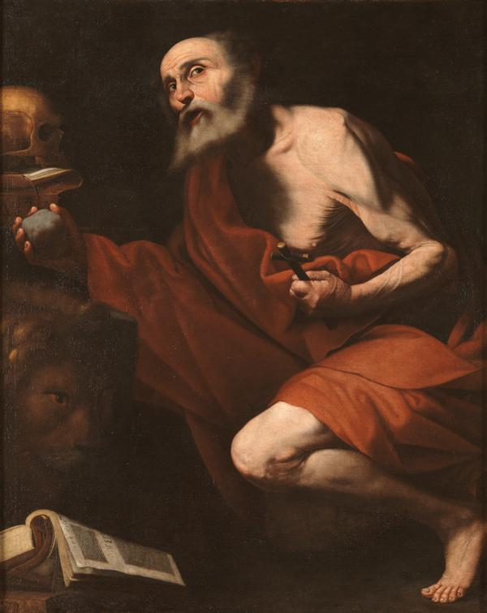
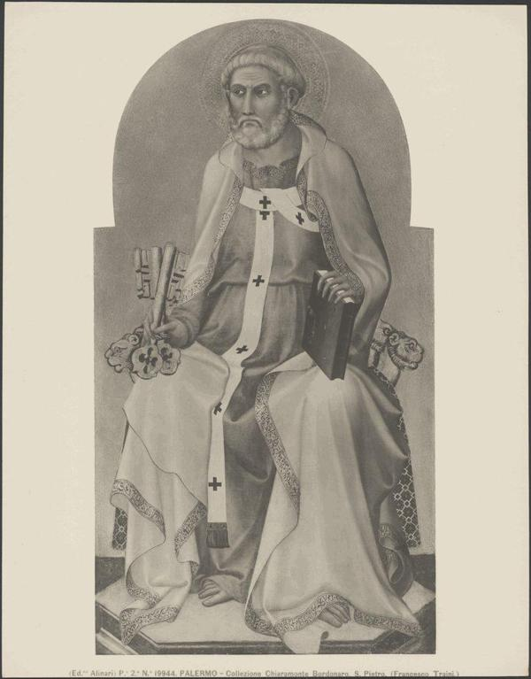
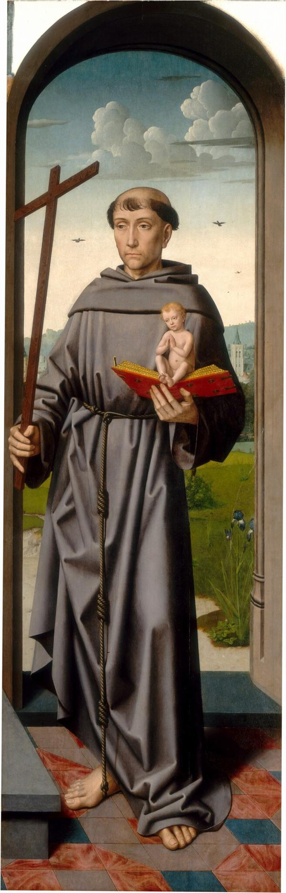

# ArtDL

ArtDL is a comprehensive dataset designed for iconography classification in paintings, primarily from the Renaissance period, focusing on Christian art. It comprises 42,479 images sourced from 10 online museums and open data collections. Each painting is annotated into one of 19 classes based on the Iconclass classification system, which is widely used for art and iconography research.

The test set is downloaded directly from the paper's author's official [repository](https://github.com/iFede94/ArtDL/blob/main/sets/test.txt).

Two tests have been done: one where we classify the images with the labels provided by the authors, i.e. the "Label" column in Tab. 2. In the second test, we test the Image Classificator using [IconClass](https://iconclass.org/) description to the label, see Tab. 2, column "Description".

| IconClass ID        | Label               | Description                                                                                                                             |
|---------------------|---------------------|-----------------------------------------------------------------------------------------------------------------------------------------|
| 11H(ANTONY OF PADUA) | Antony of Padua   | the Franciscan monk Antony of Padua; possible attributes: ass, book, crucifix, flowered cross, flaming heart, infant Christ (on book), lily - portrait of male saint |
| 11H(JOHN THE BAPTIST) | John the Baptist    | John the Baptist; possible attributes: book, reed cross, baptismal cup, honeycomb, lamb, staff                                         |
| 11H(PAUL)           | Paul                | the apostle Paul of Tarsus; possible attributes: book, scroll, sword                                                                   |
| 11H(FRANCIS)        | Francis of Assisi   | founder of the Order of Friars Minor (Franciscans), Francis(cus) of Assisi; possible attributes: book, crucifix, lily, skull, stigmata  |
| 11HH(MARY MAGDALENE) | Mary Magdalene      | the penitent harlot Mary Magdalene; possible attributes: book (or scroll), crown, crown of thorns, crucifix, jar of ointment, mirror, musical instrument, palm-branch, rosary, scourge |
| 11H(JEROME)         | Jerome              | the monk and hermit Jerome (Hieronymus); possible attributes: book, cardinal's hat, crucifix, hour-glass, lion, skull, stone           |
| 11H(DOMINIC)        | Saint Dominic       | Dominic(us) Guzman of Calerueja, founder of the Order of Preachers (or Dominican (Black) Friars; possible attributes: book, dog with flaming torch, lily, loaf of bread, rosary, star |
| 11F(MARY)           | Virgin Mary         | the Virgin Mary                                                                                                                        |
| 11H(PETER)          | Peter               | the apostle Peter, first bishop of Rome; possible attributes: book, cock, (upturned) cross, (triple) crozier, fish, key, scroll, ship, tiara |
| 11H(SEBASTIAN)      | Saint Sebastian     | the martyr Sebastian; possible attributes: arrow(s), bow, tree-trunk                                                                   

**Table X.** The classes to test. The labels are provided by the authors. The descriptions are manually retrieved from the IconClass website.

## Few shot steps:

I choose 5 pictures to fine-tune the models. The intention is to keep this number very low. The images are selected by having these characteristics:

1. Being one per class, and being part of the classes with lower F1 scores.
2. Being in the train dataset
3. Showing only the icon, and presenting the possible attributes from the IconCLass description (manually assessed)

The resulting images are the following:

**11H(JEROME)**

**11H(PETER)**

**11H(PAUL)**

**11H(FRANCIS)**

**11H(DOMINIC)**

