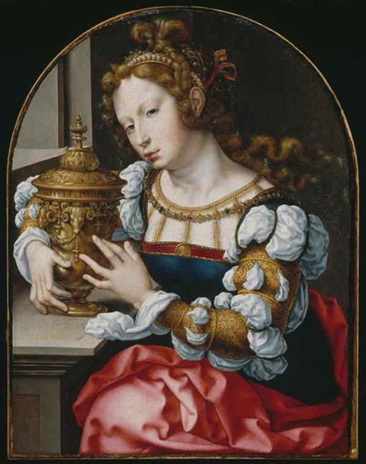
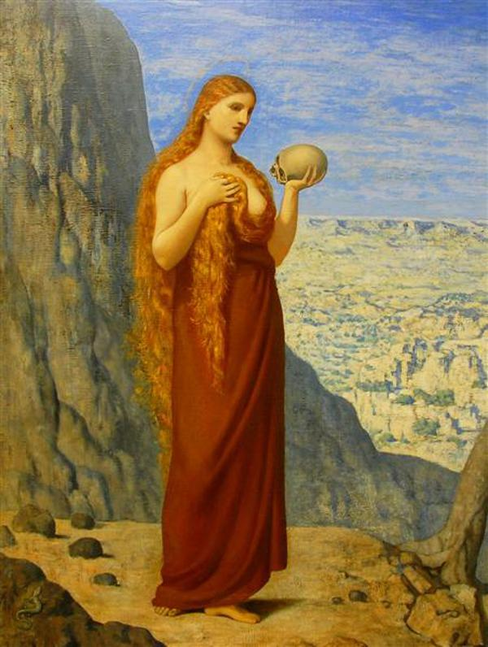
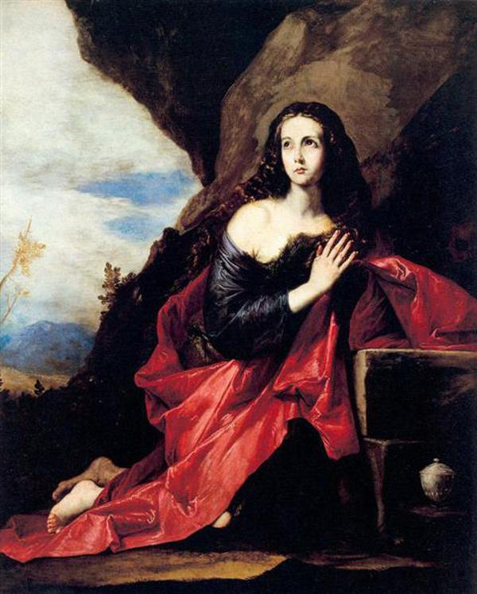
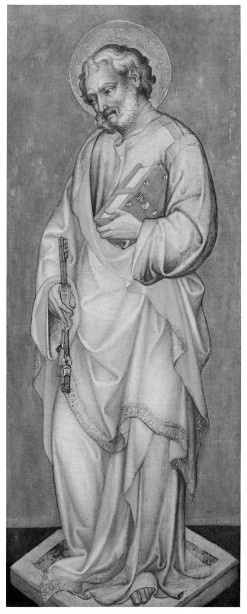
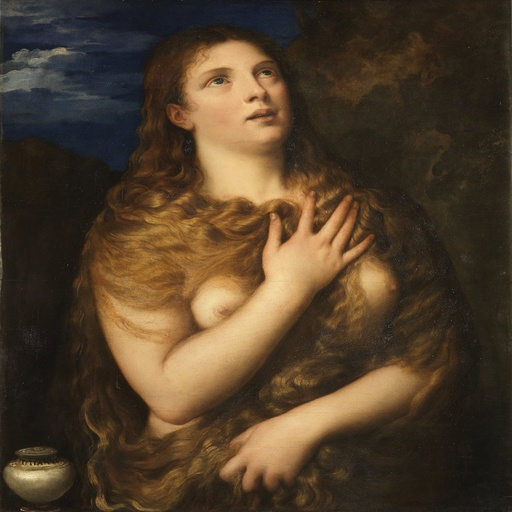

# Cross-Dataset Image Similarity Analysis

## Overview

This analysis examines the similarity between images across different datasets using perceptual and robust hashing techniques. The focus is on identifying similar images between different datasets, rather than within the same dataset.

## Datasets Analyzed

The following datasets were analyzed:

- ArtDL (1864 images)
- ICONCLASS (592 images)
- wikidata (718 images)

## Methodology

Two different hashing techniques were used to compute image similarity:

1. **Perceptual Hashing (phash, size=8x8)**: 
   - Detects visually similar images based on their appearance
   - Threshold for similarity: 8

2. **Robust Hashing (block mean hash, size=16x16)**: 
   - More robust to minor image transformations
   - Threshold for similarity: 8

## Results

### Dataset Overlap

The Venn diagrams show the overlap between the datasets:

- [Perceptual Hash Similarity Venn Diagram](./perceptual_venn_diagram.png)
- [Robust Hash Similarity Venn Diagram](./robust_venn_diagram.png)

The size of each circle is proportional to the number of images in the dataset, and the overlapping regions show the number of similar images between datasets.

### Perceptual Hash Results

**Total duplicate images found: 46**

#### Duplicates by Dataset Pair

- **ArtDL - wikidata**: 44 duplicates
  - Examples:
    - 1939_1_291 ↔ Q20173065
    - 1939_1_80 ↔ Q20173671
    - 1950_11_1_a ↔ Q20173413
    - 253141 ↔ Q3947314
    - 253669 ↔ Q20540321
    - 258398 ↔ Q19820268
    - 273854 ↔ Q6004260
    - 408706434 ↔ Q20173671
    - Q15974339 ↔ Q15974339
    - Q17335796 ↔ Q17335796
    - ... and 34 more
- **ICONCLASS - wikidata**: 2 duplicates
  - Examples:
    - IIHIM_838250489 ↔ Q63191747
    - IIHIM_RIJKS_-649904531 ↔ Q17328232

### Robust Hash Results

**Total duplicate images found: 35**

#### Duplicates by Dataset Pair

- **ArtDL - ICONCLASS**: 2 duplicates
  - Examples:
    - ICCD3163621_13815-H ↔ IIHIM_RIJKS_1401436342
    - ICCD3710537_375754 ↔ IIHIM_RIJKS_1827277148
- **ArtDL - wikidata**: 32 duplicates
  - Examples:
    - 1939_1_291 ↔ Q20173065
    - 1939_1_80 ↔ Q20173671
    - 1950_11_1_a ↔ Q20173413
    - 253141 ↔ Q3947314
    - 253669 ↔ Q20540321
    - 258398 ↔ Q19820268
    - Q15974339 ↔ Q15974339
    - Q17335796 ↔ Q17335796
    - Q18748614 ↔ Q18748614
    - Q19925792 ↔ Q19925792
    - ... and 22 more
- **ICONCLASS - wikidata**: 1 duplicates
  - Examples:
    - IIHIM_RIJKS_-649904531 ↔ Q17328232

### Cross-Dataset Duplicates

The following files contain information about cross-dataset similarities:

- **Consolidated duplicates**:
  - Perceptual hash duplicates: `perceptual_cross_duplicates.json`
  - Robust hash duplicates: `robust_cross_duplicates.json`

## Visual Examples of Similar Images

Below are examples of similar images found across different datasets. Each row shows a pair of similar images with their dataset and filename information.

| Image 1 | Image 2 |
|---------|---------|
|    **Dataset:** ArtDL   **Filename:** 1939_1_291 |    **Dataset:** wikidata   **Filename:** Q20173065 |
|    **Dataset:** ArtDL   **Filename:** 1939_1_80 |    **Dataset:** wikidata   **Filename:** Q20173671 |
|    **Dataset:** ArtDL   **Filename:** 1950_11_1_a |    **Dataset:** wikidata   **Filename:** Q20173413 |
|    **Dataset:** ArtDL   **Filename:** 253141 |    **Dataset:** wikidata   **Filename:** Q3947314 |
|    **Dataset:** ArtDL   **Filename:** 253669 |    **Dataset:** wikidata   **Filename:** Q20540321 |
|    **Dataset:** ArtDL   **Filename:** 258398 |    **Dataset:** wikidata   **Filename:** Q19820268 |
|    **Dataset:** ArtDL   **Filename:** 273854 |    **Dataset:** wikidata   **Filename:** Q6004260 |
|    **Dataset:** ArtDL   **Filename:** 408706434 |    **Dataset:** wikidata   **Filename:** Q20173671 |
|    **Dataset:** ArtDL   **Filename:** Q15974339 |    **Dataset:** wikidata   **Filename:** Q15974339 |
|    **Dataset:** ArtDL   **Filename:** Q17335796 |    **Dataset:** wikidata   **Filename:** Q17335796 |

## Dataset-specific Files

Each dataset has its own directory with the following files:

- **ArtDL**:
  - Perceptual hashes: `ArtDL/perceptual_hashes.json`
  - Robust hashes: `ArtDL/robust_hashes.json`
- **ICONCLASS**:
  - Perceptual hashes: `ICONCLASS/perceptual_hashes.json`
  - Robust hashes: `ICONCLASS/robust_hashes.json`
- **wikidata**:
  - Perceptual hashes: `wikidata/perceptual_hashes.json`
  - Robust hashes: `wikidata/robust_hashes.json`

## Summary

This analysis focused on cross-dataset image similarity, computing hashes for all images and comparing them across different datasets. The results provide insights into the overlap between datasets and can be used to identify duplicate or similar images across collections.
