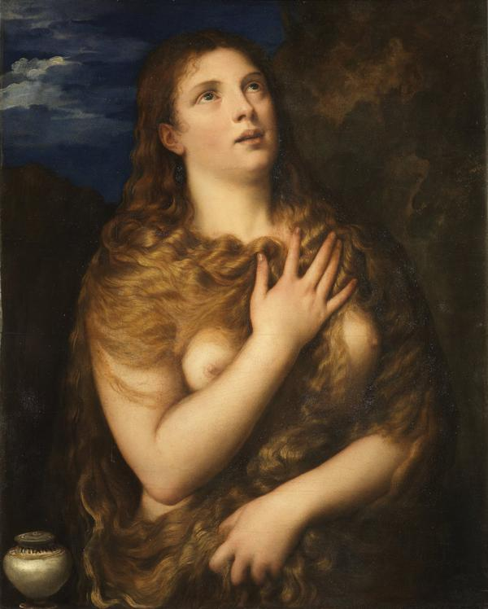
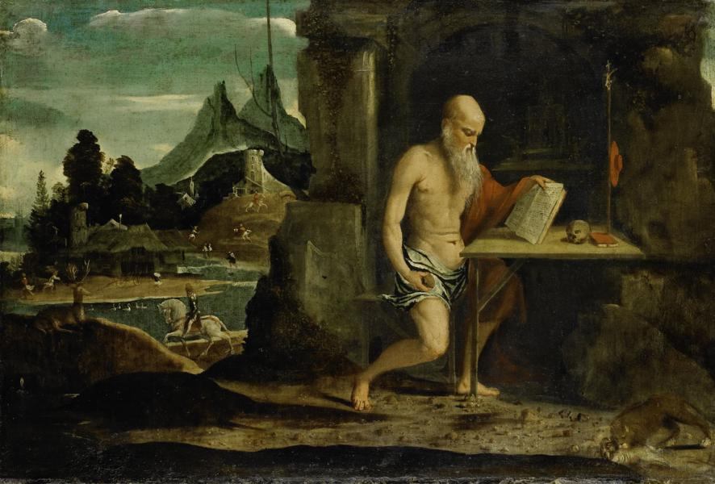
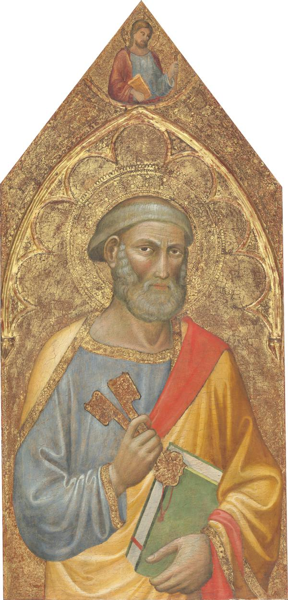
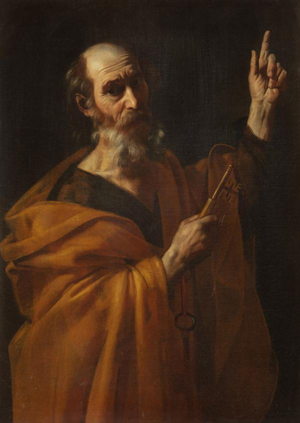
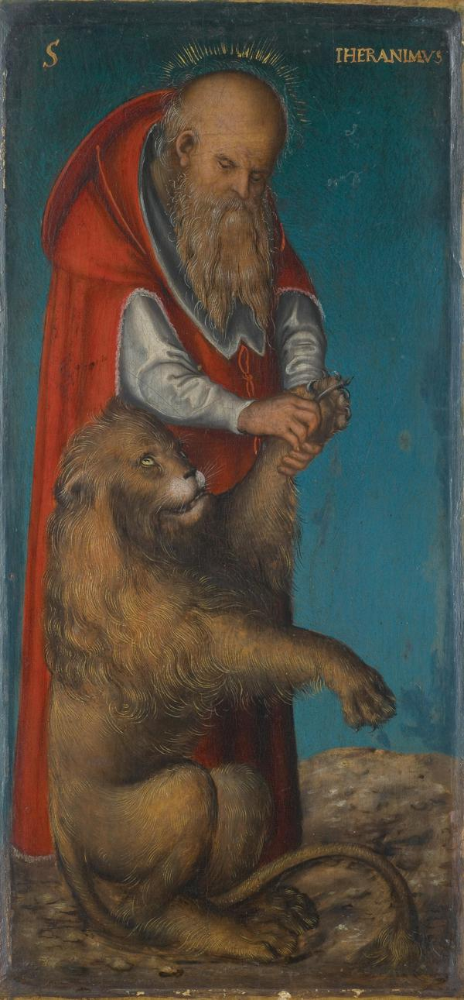
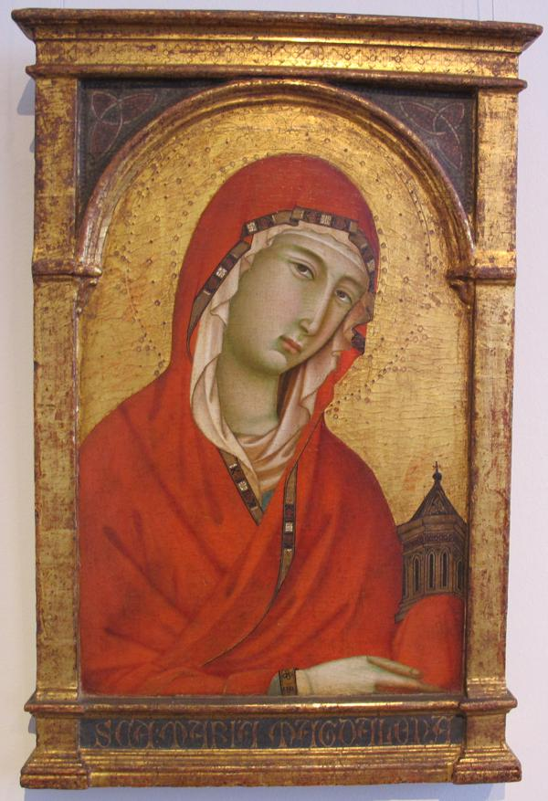
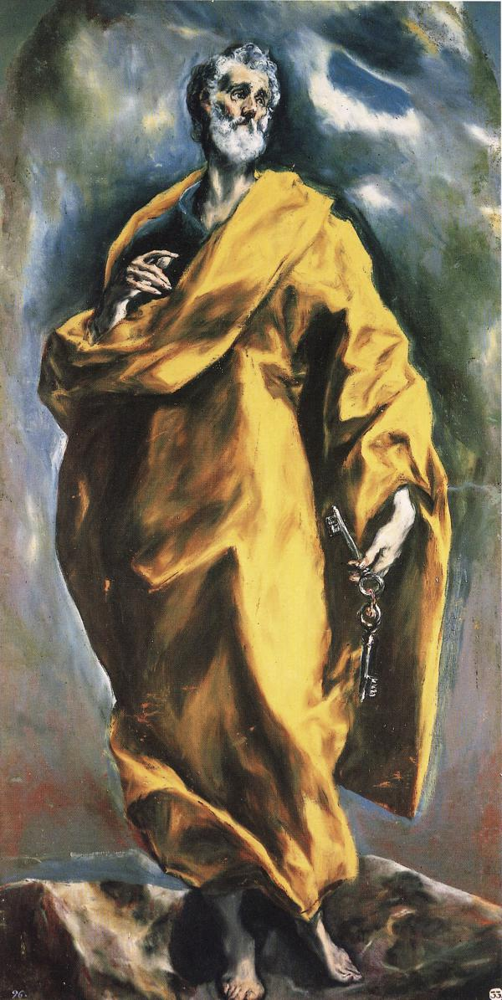

# Cross-Dataset Image Similarity Analysis

## Overview

This analysis examines the similarity between images across different datasets using perceptual and robust hashing techniques. The focus is on identifying similar images between different datasets, rather than within the same dataset.

## Datasets Analyzed

The following datasets were analyzed:

- ArtDL (1864 images)
- ICONCLASS (863 images)
- wikidata (717 images)

## Methodology

Two different hashing techniques were used to compute image similarity:

1. **Perceptual Hashing (phash, size=8x8)**: 
   - Detects visually similar images based on their appearance
   - Threshold for similarity: 8

2. **Robust Hashing (block mean hash, size=16x16)**: 
   - More robust to minor image transformations
   - Threshold for similarity: 8

## Results

### Dataset Overlap

The Venn diagrams show the overlap between the datasets:

- [Perceptual Hash Similarity Venn Diagram](./perceptual_venn_diagram.png)
- [Robust Hash Similarity Venn Diagram](./robust_venn_diagram.png)

The size of each circle is proportional to the number of images in the dataset, and the overlapping regions show the number of similar images between datasets.

### Cross-Dataset Duplicates

The following files contain information about cross-dataset similarities:

- **Consolidated duplicates**:
  - Perceptual hash duplicates: `perceptual_cross_duplicates.json`
  - Robust hash duplicates: `robust_cross_duplicates.json`

## All Similar Image Pairs

Below are all pairs of similar images found across different datasets.

### Perceptual Hash Pairs

| Image 1 | Image 2 |
|---------|---------|
|    **Dataset:** ArtDL   **Filename:** eyck_van_jan_02page_31jerom |    **Dataset:** ICONCLASS   **Filename:** IIHIM_1441633156 |
|    **Dataset:** ArtDL   **Filename:** 1939_1_291 |    **Dataset:** wikidata   **Filename:** Q20173065 |
|    **Dataset:** ArtDL   **Filename:** 1950_11_1_a |    **Dataset:** wikidata   **Filename:** Q20173413 |
|    **Dataset:** ArtDL   **Filename:** 253141 |    **Dataset:** wikidata   **Filename:** Q3947314 |
|    **Dataset:** ArtDL   **Filename:** 258398 |    **Dataset:** wikidata   **Filename:** Q19820268 |
|    **Dataset:** ArtDL   **Filename:** 273854 |    **Dataset:** wikidata   **Filename:** Q6004260 |
|    **Dataset:** ArtDL   **Filename:** Q15974339 |    **Dataset:** wikidata   **Filename:** Q15974339 |
|    **Dataset:** ArtDL   **Filename:** Q17335796 |    **Dataset:** wikidata   **Filename:** Q17335796 |
|    **Dataset:** ArtDL   **Filename:** Q18225338 |    **Dataset:** wikidata   **Filename:** Q18225338 |
|    **Dataset:** ArtDL   **Filename:** Q18748614 |    **Dataset:** wikidata   **Filename:** Q18748614 |
|    **Dataset:** ArtDL   **Filename:** Q19926040 |    **Dataset:** wikidata   **Filename:** Q19926040 |
|    **Dataset:** ArtDL   **Filename:** Q20173413 |    **Dataset:** wikidata   **Filename:** Q20173413 |
|    **Dataset:** ArtDL   **Filename:** Q20173883 |    **Dataset:** wikidata   **Filename:** Q20173883 |
|    **Dataset:** ArtDL   **Filename:** Q20267955 |    **Dataset:** wikidata   **Filename:** Q20267955 |
|    **Dataset:** ArtDL   **Filename:** Q21283213 |    **Dataset:** wikidata   **Filename:** Q21283213 |
|    **Dataset:** ArtDL   **Filename:** Q2715177 |    **Dataset:** wikidata   **Filename:** Q2715177 |
|    **Dataset:** ArtDL   **Filename:** Q27981491 |    **Dataset:** wikidata   **Filename:** Q27981491 |
|    **Dataset:** ArtDL   **Filename:** Q29024815 |    **Dataset:** wikidata   **Filename:** Q29024815 |
|    **Dataset:** ArtDL   **Filename:** Q29477236 |    **Dataset:** wikidata   **Filename:** Q29477236 |
|    **Dataset:** ArtDL   **Filename:** Q4448822 |    **Dataset:** wikidata   **Filename:** Q4448822 |
|    **Dataset:** ArtDL   **Filename:** Q4448822 |    **Dataset:** wikidata   **Filename:** Q17321337 |
|    **Dataset:** ArtDL   **Filename:** Q4448822 |    **Dataset:** wikidata   **Filename:** Q29939692 |
|    **Dataset:** ArtDL   **Filename:** Q510799 |    **Dataset:** wikidata   **Filename:** Q510799 |
|    **Dataset:** ArtDL   **Filename:** Q55102676 |    **Dataset:** wikidata   **Filename:** Q55102676 |
|    **Dataset:** ArtDL   **Filename:** Q6004260 |    **Dataset:** wikidata   **Filename:** Q6004260 |
|    **Dataset:** ArtDL   **Filename:** Q9073676 |    **Dataset:** wikidata   **Filename:** Q9073676 |
|    **Dataset:** ArtDL   **Filename:** _C_438722921_7632 |    **Dataset:** wikidata   **Filename:** Q9015206 |
|    **Dataset:** ArtDL   **Filename:** __EX_1000788252_18423 |    **Dataset:** wikidata   **Filename:** Q20172983 |
|    **Dataset:** ArtDL   **Filename:** caravagg_07_44jerome |    **Dataset:** wikidata   **Filename:** Q2715177 |
|    **Dataset:** ArtDL   **Filename:** caravagg_11_71baptis |    **Dataset:** wikidata   **Filename:** Q9015206 |
|    **Dataset:** ArtDL   **Filename:** clouet_jean_francbap |    **Dataset:** wikidata   **Filename:** Q30096142 |
|    **Dataset:** ArtDL   **Filename:** en-SK-A-3382 |    **Dataset:** wikidata   **Filename:** Q17334273 |
|    **Dataset:** ArtDL   **Filename:** en-SK-A-4006 |    **Dataset:** wikidata   **Filename:** Q17335839 |
|    **Dataset:** ArtDL   **Filename:** greco_el_06_0603grec |    **Dataset:** wikidata   **Filename:** Q9026835 |
|    **Dataset:** ArtDL   **Filename:** greco_el_17_1703grec |    **Dataset:** wikidata   **Filename:** Q16589363 |
|    **Dataset:** ArtDL   **Filename:** hemessen_jan_stjerom |    **Dataset:** wikidata   **Filename:** Q114744953 |
|    **Dataset:** ArtDL   **Filename:** la_tour_georges_1_10penite |    **Dataset:** wikidata   **Filename:** Q3210251 |
|    **Dataset:** ArtDL   **Filename:** nogari_apostle |    **Dataset:** wikidata   **Filename:** Q50326658 |
|    **Dataset:** ArtDL   **Filename:** piero_co_z_other_mary_mag |    **Dataset:** wikidata   **Filename:** Q28229479 |
|    **Dataset:** ArtDL   **Filename:** tintoret_3b_3ground_5maryma |    **Dataset:** wikidata   **Filename:** Q11769022 |
|    **Dataset:** ICONCLASS   **Filename:** IIHIM_-1578407314 |    **Dataset:** wikidata   **Filename:** Q107443479 |
|    **Dataset:** ICONCLASS   **Filename:** IIHIM_1359909329 |    **Dataset:** wikidata   **Filename:** Q117226027 |
|    **Dataset:** ICONCLASS   **Filename:** IIHIM_838250489 |    **Dataset:** wikidata   **Filename:** Q63191747 |
|    **Dataset:** ICONCLASS   **Filename:** IIHIM_-1583071816 |    **Dataset:** wikidata   **Filename:** Q29648941 |
|    **Dataset:** ICONCLASS   **Filename:** IIHIM_RIJKS_2033920572 |    **Dataset:** wikidata   **Filename:** Q17347293 |

### Robust Hash Pairs

| Image 1 | Image 2 |
|---------|---------|
|    **Dataset:** ArtDL   **Filename:** ICCD3163621_13815-H |    **Dataset:** ICONCLASS   **Filename:** IIHIM_-1335425534 |
|    **Dataset:** ArtDL   **Filename:** ICCD3163621_13815-H |    **Dataset:** ICONCLASS   **Filename:** IIHIM_RIJKS_1401436342 |
|    **Dataset:** ArtDL   **Filename:** ICCD3710537_375754 |    **Dataset:** ICONCLASS   **Filename:** IIHIM_RIJKS_1827277148 |
|    **Dataset:** ArtDL   **Filename:** ICCD4203971_00069043 |    **Dataset:** ICONCLASS   **Filename:** IIHIM_-1335425534 |
|    **Dataset:** ArtDL   **Filename:** 1939_1_291 |    **Dataset:** wikidata   **Filename:** Q20173065 |
|    **Dataset:** ArtDL   **Filename:** 1950_11_1_a |    **Dataset:** wikidata   **Filename:** Q20173413 |
|    **Dataset:** ArtDL   **Filename:** 253141 |    **Dataset:** wikidata   **Filename:** Q3947314 |
|    **Dataset:** ArtDL   **Filename:** 258398 |    **Dataset:** wikidata   **Filename:** Q19820268 |
|    **Dataset:** ArtDL   **Filename:** Q15974339 |    **Dataset:** wikidata   **Filename:** Q15974339 |
|    **Dataset:** ArtDL   **Filename:** Q17335796 |    **Dataset:** wikidata   **Filename:** Q17335796 |
|    **Dataset:** ArtDL   **Filename:** Q18748614 |    **Dataset:** wikidata   **Filename:** Q18748614 |
|    **Dataset:** ArtDL   **Filename:** Q19926040 |    **Dataset:** wikidata   **Filename:** Q19926040 |
|    **Dataset:** ArtDL   **Filename:** Q20173413 |    **Dataset:** wikidata   **Filename:** Q20173413 |
|    **Dataset:** ArtDL   **Filename:** Q20173883 |    **Dataset:** wikidata   **Filename:** Q20173883 |
|    **Dataset:** ArtDL   **Filename:** Q20267955 |    **Dataset:** wikidata   **Filename:** Q20267955 |
|    **Dataset:** ArtDL   **Filename:** Q21283213 |    **Dataset:** wikidata   **Filename:** Q21283213 |
|    **Dataset:** ArtDL   **Filename:** Q2715177 |    **Dataset:** wikidata   **Filename:** Q2715177 |
|    **Dataset:** ArtDL   **Filename:** Q29024815 |    **Dataset:** wikidata   **Filename:** Q29024815 |
|    **Dataset:** ArtDL   **Filename:** Q29477236 |    **Dataset:** wikidata   **Filename:** Q29477236 |
|    **Dataset:** ArtDL   **Filename:** Q4448822 |    **Dataset:** wikidata   **Filename:** Q4448822 |
|    **Dataset:** ArtDL   **Filename:** Q510799 |    **Dataset:** wikidata   **Filename:** Q510799 |
|    **Dataset:** ArtDL   **Filename:** Q55102676 |    **Dataset:** wikidata   **Filename:** Q55102676 |
|    **Dataset:** ArtDL   **Filename:** Q6004260 |    **Dataset:** wikidata   **Filename:** Q6004260 |
|    **Dataset:** ArtDL   **Filename:** Q9073676 |    **Dataset:** wikidata   **Filename:** Q9073676 |
|    **Dataset:** ArtDL   **Filename:** __EX_1000788252_18423 |    **Dataset:** wikidata   **Filename:** Q20172983 |
|    **Dataset:** ArtDL   **Filename:** clouet_jean_francbap |    **Dataset:** wikidata   **Filename:** Q30096142 |
|    **Dataset:** ArtDL   **Filename:** en-SK-A-3382 |    **Dataset:** wikidata   **Filename:** Q17334273 |
|    **Dataset:** ArtDL   **Filename:** en-SK-A-4006 |    **Dataset:** wikidata   **Filename:** Q17335839 |
|    **Dataset:** ArtDL   **Filename:** greco_el_17_1703grec |    **Dataset:** wikidata   **Filename:** Q16589363 |
|    **Dataset:** ArtDL   **Filename:** hemessen_jan_stjerom |    **Dataset:** wikidata   **Filename:** Q114744953 |
|    **Dataset:** ICONCLASS   **Filename:** IIHIM_1359909329 |    **Dataset:** wikidata   **Filename:** Q117226027 |
|    **Dataset:** ICONCLASS   **Filename:** IIHIM_RIJKS_2033920572 |    **Dataset:** wikidata   **Filename:** Q17347293 |

## Dataset-specific Files

Each dataset has its own directory with the following files:

- **ArtDL**:
  - Perceptual hashes: `ArtDL/perceptual_hashes.json`
  - Robust hashes: `ArtDL/robust_hashes.json`
- **ICONCLASS**:
  - Perceptual hashes: `ICONCLASS/perceptual_hashes.json`
  - Robust hashes: `ICONCLASS/robust_hashes.json`
- **wikidata**:
  - Perceptual hashes: `wikidata/perceptual_hashes.json`
  - Robust hashes: `wikidata/robust_hashes.json`

## Summary

This analysis focused on cross-dataset image similarity, computing hashes for all images and comparing them across different datasets. The results provide insights into the overlap between datasets and can be used to identify duplicate or similar images across collections.
