## Image Pairs for siglip-base-patch16-512 (test_1)

### Correctly Predicted Pairs

| Pair | Image 1 | Dataset | Ground Truth | Predicted | Image 2 | Dataset | Ground Truth | Predicted |
|------|---------|---------|--------------|-----------|---------|---------|--------------|-----------|
| 1 |  | ArtDL | 11H(JOHN THE BAPTIST) | 11H(JOHN THE BAPTIST) |  | wikidata | 11H(JOHN THE BAPTIST) | 11H(JOHN THE BAPTIST) |
| 2 |  | ArtDL | 11HH(MARY MAGDALENE) | 11HH(MARY MAGDALENE) |  | wikidata | 11HH(MARY MAGDALENE) | 11HH(MARY MAGDALENE) |
| 3 |  | ArtDL | 11HH(MARY MAGDALENE) | 11HH(MARY MAGDALENE) |  | wikidata | 11HH(MARY MAGDALENE) | 11HH(MARY MAGDALENE) |
| 4 |  | ArtDL | 11HH(MARY MAGDALENE) | 11HH(MARY MAGDALENE) |  | wikidata | 11HH(MARY MAGDALENE) | 11HH(MARY MAGDALENE) |
| 5 |  | ArtDL | 11HH(MARY MAGDALENE) | 11HH(MARY MAGDALENE) |  | wikidata | 11HH(MARY MAGDALENE) | 11HH(MARY MAGDALENE) |
| 6 |  | ArtDL | 11HH(MARY MAGDALENE) | 11HH(MARY MAGDALENE) |  | wikidata | 11HH(MARY MAGDALENE) | 11HH(MARY MAGDALENE) |
| 7 | 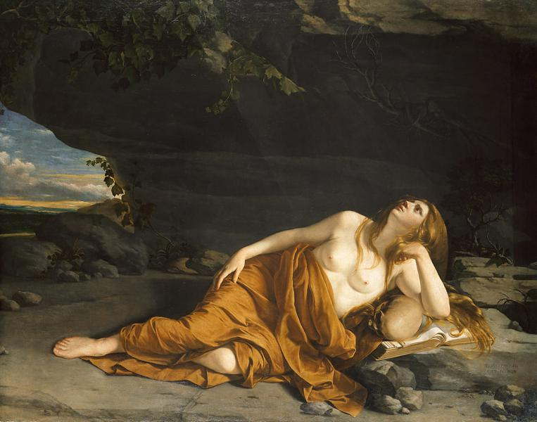 | ArtDL | 11HH(MARY MAGDALENE) | 11HH(MARY MAGDALENE) |  | wikidata | 11HH(MARY MAGDALENE) | 11HH(MARY MAGDALENE) |
| 8 |  | ArtDL | 11HH(MARY MAGDALENE) | 11HH(MARY MAGDALENE) | 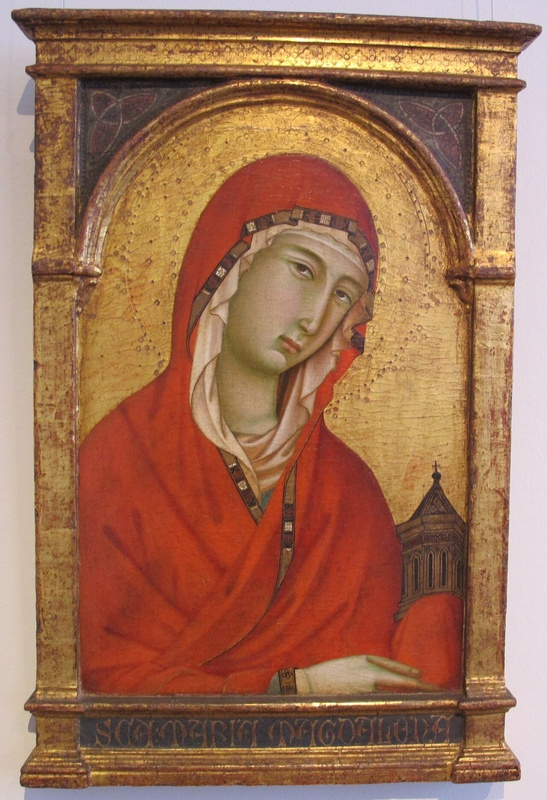 | wikidata | 11HH(MARY MAGDALENE) | 11HH(MARY MAGDALENE) |
| 9 |  | ArtDL | 11HH(MARY MAGDALENE) | 11HH(MARY MAGDALENE) |  | wikidata | 11HH(MARY MAGDALENE) | 11HH(MARY MAGDALENE) |
| 10 |  | ArtDL | 11HH(MARY MAGDALENE) | 11HH(MARY MAGDALENE) |  | wikidata | 11HH(MARY MAGDALENE) | 11HH(MARY MAGDALENE) |
| 11 |  | ArtDL | 11H(JOHN THE BAPTIST) | 11H(JOHN THE BAPTIST) |  | wikidata | 11H(JOHN THE BAPTIST) | 11H(JOHN THE BAPTIST) |
| 12 |  | ArtDL | 11HH(MARY MAGDALENE) | 11HH(MARY MAGDALENE) |  | wikidata | 11HH(MARY MAGDALENE) | 11HH(MARY MAGDALENE) |
| 13 |  | ArtDL | 11HH(MARY MAGDALENE) | 11HH(MARY MAGDALENE) |  | wikidata | 11HH(MARY MAGDALENE) | 11HH(MARY MAGDALENE) |
| 14 |  | ICONCLASS | 11HH(MARY MAGDALENE) | 11HH(CATHERINE) |  | wikidata | 11HH(MARY MAGDALENE) | 11HH(CATHERINE) |

### Incorrectly Predicted Pairs

| Pair | Image 1 | Dataset | Ground Truth | Predicted | Image 2 | Dataset | Ground Truth | Predicted |
|------|---------|---------|--------------|-----------|---------|---------|--------------|-----------|
| 1 |  | ArtDL | 11F(MARY) | 11F(MARY) | 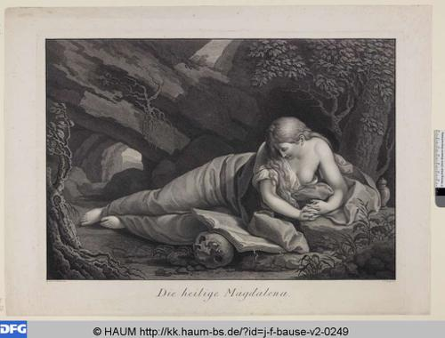 | ICONCLASS | 11HH(MARY MAGDALENE) | 11HH(MARY MAGDALENE) |
| 2 |  | ArtDL | 11F(MARY) | 11F(MARY) |  | ICONCLASS | 11HH(MARY MAGDALENE) | 11HH(MARY MAGDALENE) |
| 3 | 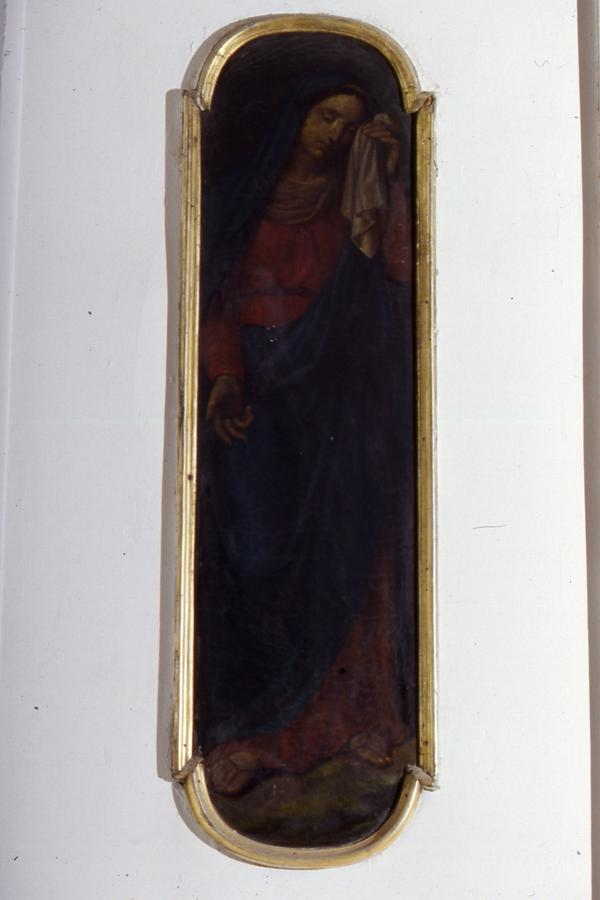 | ArtDL | 11F(MARY) | 11F(MARY) |  | ICONCLASS | 11HH(CATHERINE) | 11HH(CATHERINE) |
| 4 | 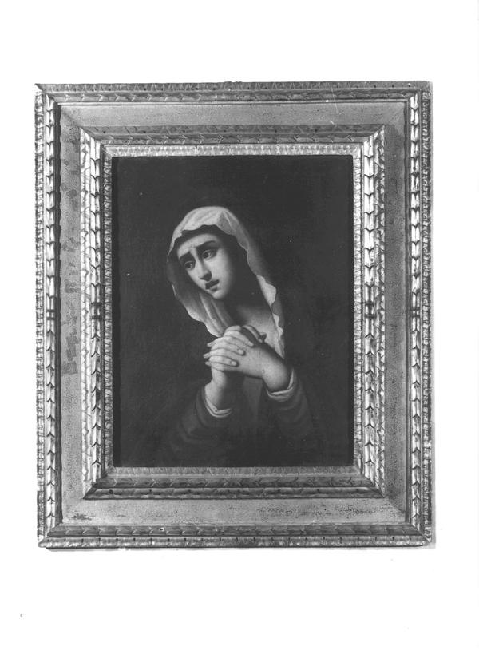 | ArtDL | 11F(MARY) | 11F(MARY) |  | ICONCLASS | 11HH(MARY MAGDALENE) | 11HH(MARY MAGDALENE) |
| 5 |  | ArtDL | 11H(PETER) | 11H(DOMINIC) |  | wikidata | 11H(PETER) | 11H(PETER) |
| 6 |  | ArtDL | 11H(PETER) | 11H(ANTONY OF PADUA) |  | wikidata | 11H(PETER) | 11H(PAUL) |
| 7 |  | ArtDL | 11H(JEROME) | 11H(JOHN THE BAPTIST) |  | wikidata | 11H(JEROME) | 11H(JEROME) |
| 8 |  | ArtDL | 11H(JEROME) | 11H(JOHN THE BAPTIST) |  | wikidata | 11H(JEROME) | 11H(JEROME) |
| 9 |  | ArtDL | 11HH(MARY MAGDALENE) | 11HH(MARY MAGDALENE) |  | wikidata | 11HH(MARY MAGDALENE) | 11HH(CATHERINE) |
| 10 |  | ArtDL | 11H(PETER) | 11H(ANTONY OF PADUA) |  | wikidata | 11H(PETER) | 11H(PAUL) |
| 11 |  | ArtDL | 11H(PETER) | 11H(JOHN THE BAPTIST) |  | wikidata | 11H(PETER) | 11H(PETER) |
| 12 |  | ArtDL | 11HH(MARY MAGDALENE) | 11HH(MARY MAGDALENE) |  | wikidata | 11HH(MARY MAGDALENE) | 11HH(CATHERINE) |
| 13 |  | ArtDL | 11H(PETER) | 11H(DOMINIC) | 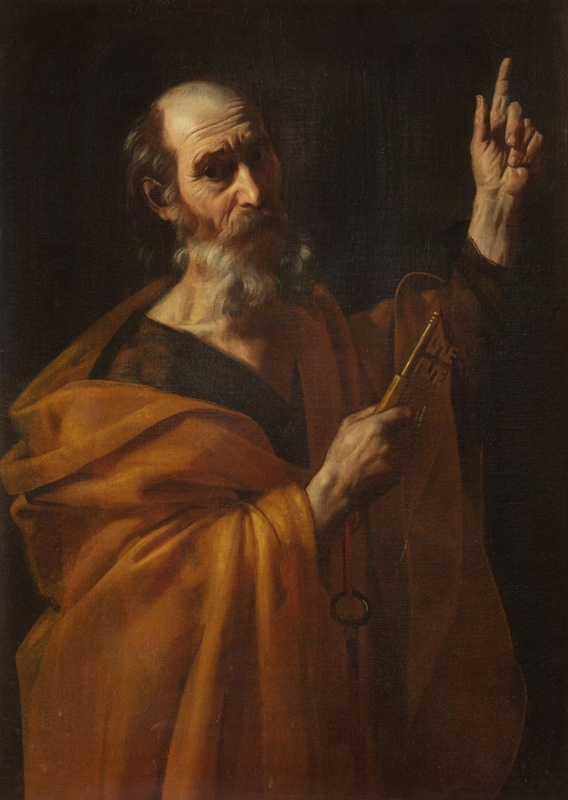 | wikidata | 11H(PETER) | 11H(PETER) |
| 14 |  | ArtDL | 11H(JEROME) | 11H(DOMINIC) |  | wikidata | 11H(JEROME) | 11H(JEROME) |
| 15 |  | ArtDL | 11H(JEROME) | 11H(FRANCIS) |  | wikidata | 11H(JEROME) | 11H(JEROME) |
| 16 |  | ArtDL | 11H(JEROME) | 11H(DOMINIC) | 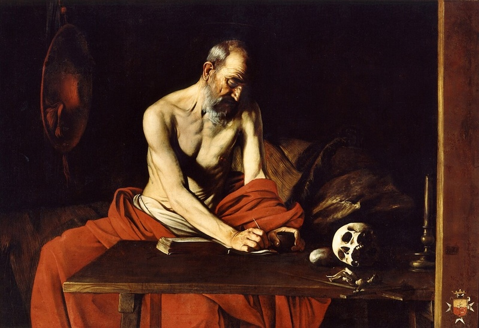 | wikidata | 11H(JEROME) | 11H(JEROME) |
| 17 |  | ArtDL | 11HH(MARY MAGDALENE) | 11HH(MARY MAGDALENE) | 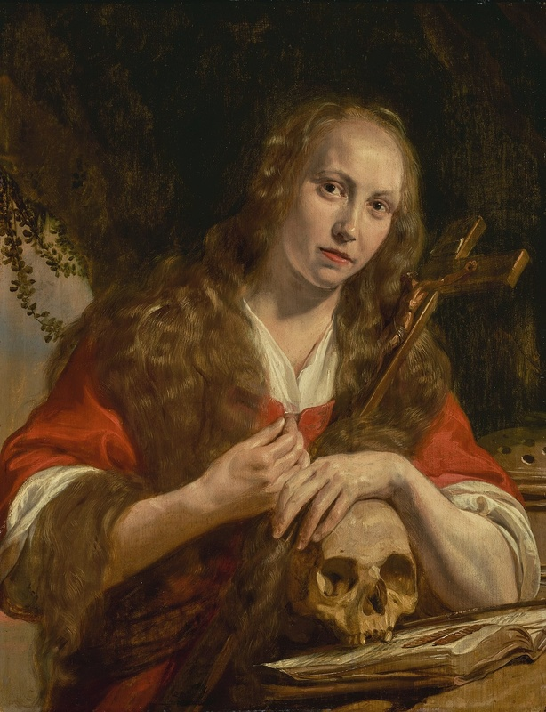 | wikidata | 11HH(MARY MAGDALENE) | 11HH(CATHERINE) |
| 18 |  | ArtDL | 11H(PETER) | 11H(JOHN THE BAPTIST) | 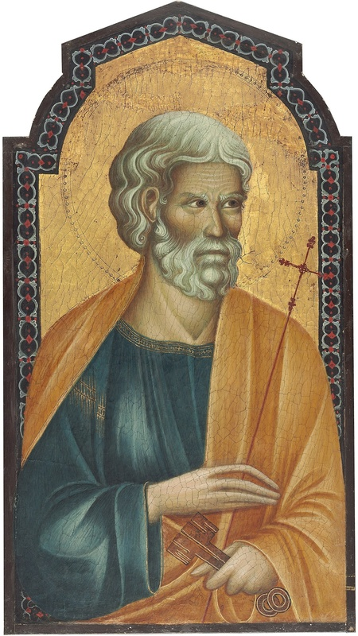 | wikidata | 11H(PETER) | 11H(PETER) |
| 19 |  | ArtDL | 11H(JOHN THE BAPTIST) | 11H(FRANCIS) | 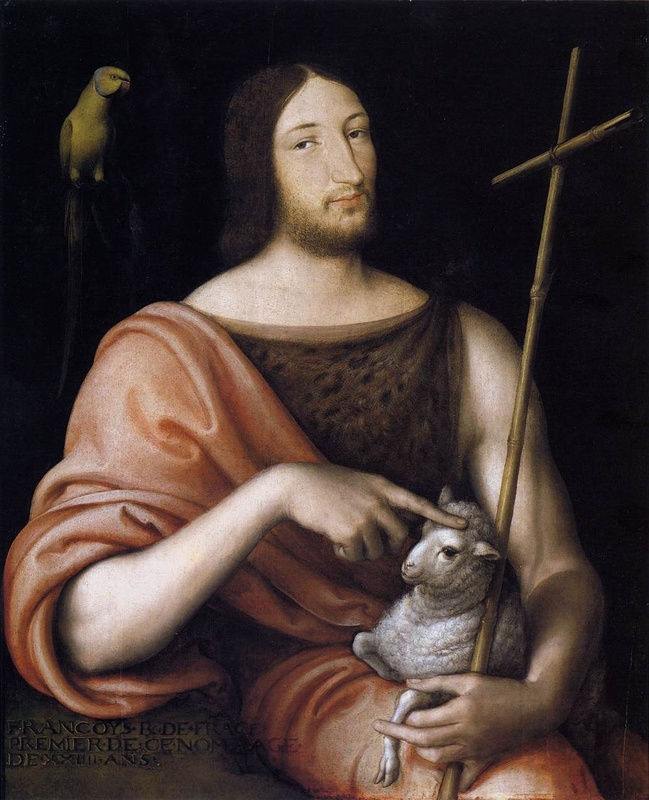 | wikidata | 11H(JOHN THE BAPTIST) | 11H(JOHN THE BAPTIST) |
| 20 |  | ArtDL | 11H(FRANCIS) | 11H(DOMINIC) |  | wikidata | 11H(FRANCIS) | 11H(JEROME) |
| 21 |  | ArtDL | 11H(JEROME) | 11H(DOMINIC) | 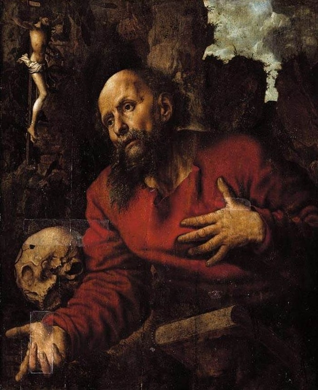 | wikidata | 11H(JEROME) | 11H(JEROME) |
| 22 |  | ICONCLASS | 11HH(MARY MAGDALENE) | 11HH(MARY MAGDALENE) | 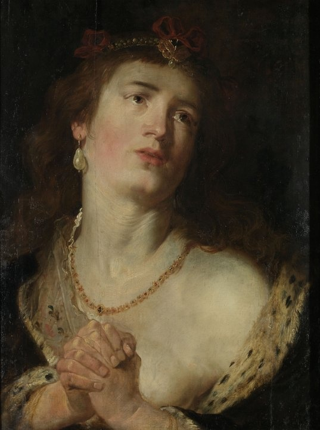 | wikidata | 11HH(MARY MAGDALENE) | 11HH(CATHERINE) |
