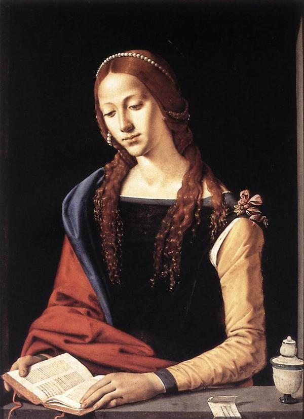
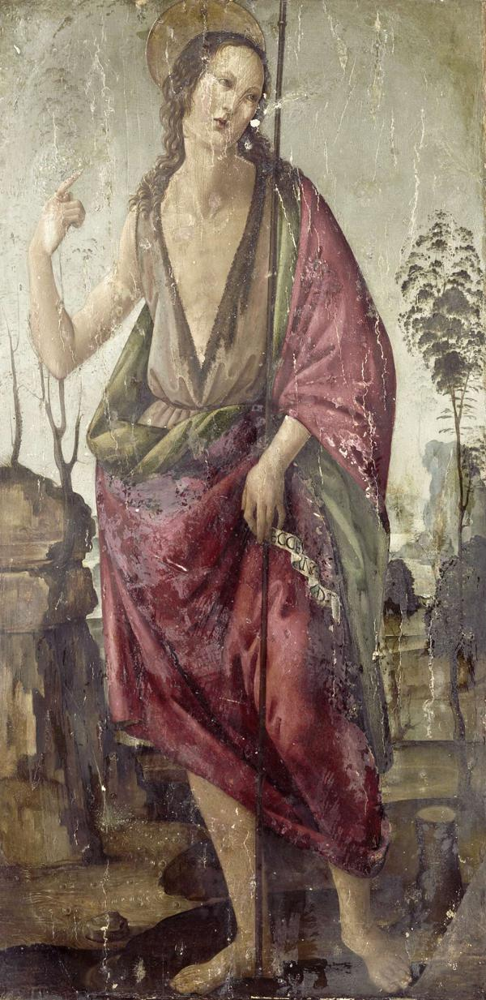
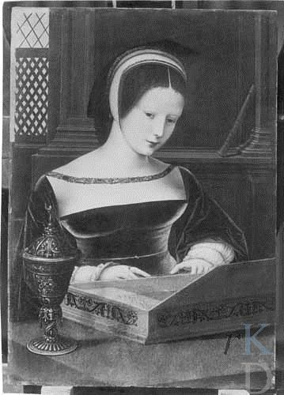
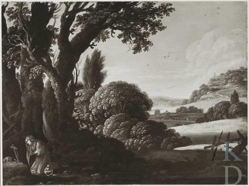
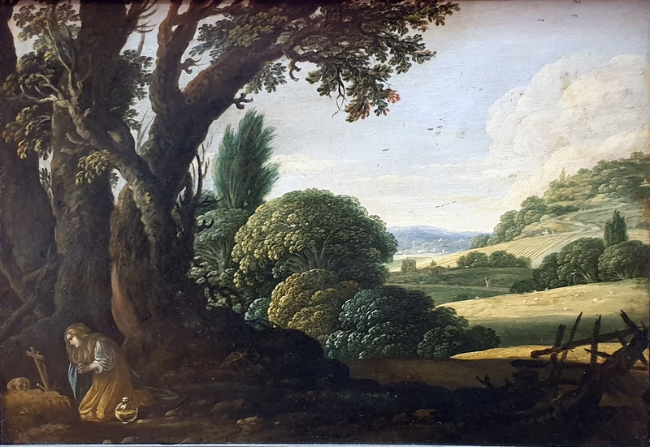
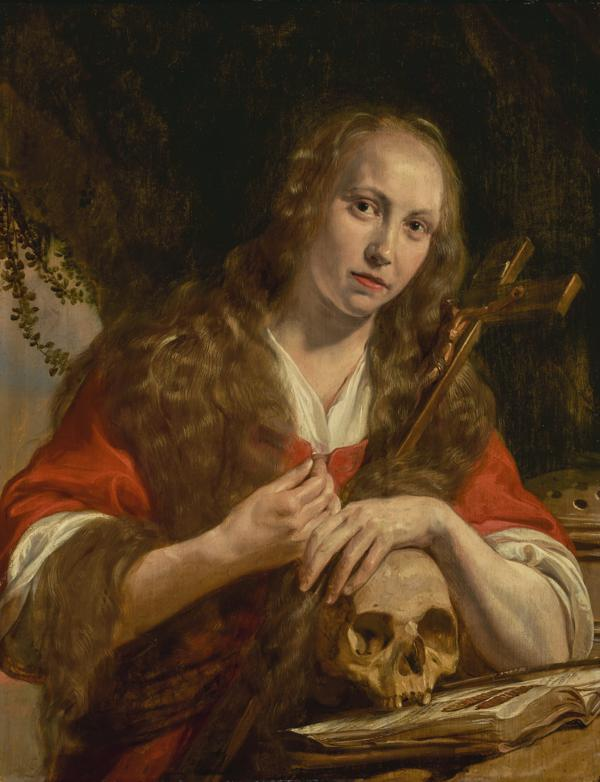

# Hard Consistency Cases

This document identifies the images and saint classes that are most difficult to predict consistently across repeated model runs.

> **Instability** = a model gives different predictions for the same image across `test_1`, `test_2`, `test_3`. The instability rate is the fraction of all models where this occurs for a given image.

## Top 5 Most Unstable Image Pairs

Each row shows a pair of images tested together. Both metrics are counted across all models and all 3 runs (one observation = one model × one test run).

| # | Image A | Image B | Ground Truth | Both predicted same class | Both predicted same class (correct) |
|---|---------|---------|-------------|--------------------------|-------------------------------------|
| 1 |  |  | Mary Magdalene | 14/42 (33%) | 14/42 (33%) |
| 2 |  |  | John the Baptist | 24/42 (57%) | 22/42 (52%) |
| 3 |  |  | Mary Magdalene | 21/42 (50%) | 12/42 (29%) |
| 4 |  |  | Mary Magdalene | 16/42 (38%) | 16/42 (38%) |
| 5 |  |  | Mary Magdalene | 20/42 (48%) | 20/42 (48%) |

> **Both predicted same class**: number of (model, run) observations where the model assigned the same label to both images (count/total, %).  **Both predicted same class (correct)**: same, but the shared label also matches the ground truth.

---

## Most Unstable Classes — Incorrect Prediction Distribution

For each saint class, this table shows how often incorrect predictions are made and what alternative classes models tend to predict instead. Counts aggregate all models, all test runs, and all images of that class.

| Saint (Ground Truth) | Total Predictions | Wrong Predictions | Error Rate | Top Wrong Predictions |
|----------------------|-------------------|-------------------|------------|-----------------------|
| 11HH(MARY MAGDALENE) (Mary Magdalene) | 1890 | 353 | 18.7% | **CATHERINE** (129), **FRANCIS** (52), **JEROME** (32), **JOHN THE BAPTIST** (28) |
| 11H(PETER) (Peter) | 537 | 221 | 41.2% | **JOHN THE BAPTIST** (70), **PAUL** (27), **MARY MAGDALENE** (23), **JEROME** (22) |
| 11H(JEROME) (Jerome) | 630 | 201 | 31.9% | **MARY MAGDALENE** (62), **JOHN THE BAPTIST** (44), **JOHN** (19), **CATHERINE** (17) |
| 11H(JOHN THE BAPTIST) (John the Baptist) | 378 | 129 | 34.1% | **SEBASTIAN** (23), **FRANCIS** (18), **JEROME** (18), **MARY MAGDALENE** (17) |
| 11H(FRANCIS) (Francis) | 84 | 20 | 23.8% | **JOSEPH** (8), **SEBASTIAN** (4), **JOHN** (2), **DOMINIC** (2) |

---

### Detailed Confusion per Saint

#### 11HH(MARY MAGDALENE) (Mary Magdalene)

Total predictions: **1890** — Wrong: **353** (18.7%)

| Predicted As | Count | % of Errors |
|--------------|-------|-------------|
| 11HH(CATHERINE) (CATHERINE) | 129 | 36.5% |
| 11H(FRANCIS) (FRANCIS) | 52 | 14.7% |
| 11H(JEROME) (JEROME) | 32 | 9.1% |
| 11H(JOHN THE BAPTIST) (JOHN THE BAPTIST) | 28 | 7.9% |
| 11F(MARY) (11F(MARY)) | 27 | 7.6% |
| 11H(ANTONY ABBOT) (ANTONY ABBOT) | 24 | 6.8% |
| 11H(PETER) (PETER) | 22 | 6.2% |
| 11H(JOHN) (JOHN) | 13 | 3.7% |
| 11H(JOSEPH) (JOSEPH) | 13 | 3.7% |
| 11H(PAUL) (PAUL) | 5 | 1.4% |
| 11H(LUKE) (LUKE) | 3 | 0.8% |
| 11H(ANTONY OF PADUA) (ANTONY OF PADUA) | 2 | 0.6% |
| 11H(SEBASTIAN) (SEBASTIAN) | 2 | 0.6% |
| 11H(DOMINIC) (DOMINIC) | 1 | 0.3% |

#### 11H(PETER) (Peter)

Total predictions: **537** — Wrong: **221** (41.2%)

| Predicted As | Count | % of Errors |
|--------------|-------|-------------|
| 11H(JOHN THE BAPTIST) (JOHN THE BAPTIST) | 70 | 31.7% |
| 11H(PAUL) (PAUL) | 27 | 12.2% |
| 11HH(MARY MAGDALENE) (MARY MAGDALENE) | 23 | 10.4% |
| 11H(JEROME) (JEROME) | 22 | 10.0% |
| 11H(FRANCIS) (FRANCIS) | 21 | 9.5% |
| 11HH(CATHERINE) (CATHERINE) | 14 | 6.3% |
| 11H(ANTONY ABBOT) (ANTONY ABBOT) | 13 | 5.9% |
| 11H(JOHN) (JOHN) | 8 | 3.6% |
| 11H(DOMINIC) (DOMINIC) | 7 | 3.2% |
| 11H(ANTONY OF PADUA) (ANTONY OF PADUA) | 7 | 3.2% |
| 11H(JOSEPH) (JOSEPH) | 6 | 2.7% |
| 11H(SEBASTIAN) (SEBASTIAN) | 2 | 0.9% |
| 11F(MARY) (11F(MARY)) | 1 | 0.5% |

#### 11H(JEROME) (Jerome)

Total predictions: **630** — Wrong: **201** (31.9%)

| Predicted As | Count | % of Errors |
|--------------|-------|-------------|
| 11HH(MARY MAGDALENE) (MARY MAGDALENE) | 62 | 30.8% |
| 11H(JOHN THE BAPTIST) (JOHN THE BAPTIST) | 44 | 21.9% |
| 11H(JOHN) (JOHN) | 19 | 9.5% |
| 11HH(CATHERINE) (CATHERINE) | 17 | 8.5% |
| 11H(JOSEPH) (JOSEPH) | 12 | 6.0% |
| 11H(DOMINIC) (DOMINIC) | 10 | 5.0% |
| 11H(ANTONY ABBOT) (ANTONY ABBOT) | 9 | 4.5% |
| 11H(PAUL) (PAUL) | 8 | 4.0% |
| 11H(SEBASTIAN) (SEBASTIAN) | 8 | 4.0% |
| 11H(FRANCIS) (FRANCIS) | 7 | 3.5% |
| 11H(ANTONY OF PADUA) (ANTONY OF PADUA) | 3 | 1.5% |
| 11H(PETER) (PETER) | 2 | 1.0% |

#### 11H(JOHN THE BAPTIST) (John the Baptist)

Total predictions: **378** — Wrong: **129** (34.1%)

| Predicted As | Count | % of Errors |
|--------------|-------|-------------|
| 11H(SEBASTIAN) (SEBASTIAN) | 23 | 17.8% |
| 11H(FRANCIS) (FRANCIS) | 18 | 14.0% |
| 11H(JEROME) (JEROME) | 18 | 14.0% |
| 11HH(MARY MAGDALENE) (MARY MAGDALENE) | 17 | 13.2% |
| 11H(JOSEPH) (JOSEPH) | 16 | 12.4% |
| 11H(JOHN) (JOHN) | 12 | 9.3% |
| 11HH(CATHERINE) (CATHERINE) | 9 | 7.0% |
| 11H(ANTONY ABBOT) (ANTONY ABBOT) | 8 | 6.2% |
| 11H(PETER) (PETER) | 5 | 3.9% |
| 11H(DOMINIC) (DOMINIC) | 2 | 1.6% |
| 11H(PAUL) (PAUL) | 1 | 0.8% |

#### 11H(FRANCIS) (Francis)

Total predictions: **84** — Wrong: **20** (23.8%)

| Predicted As | Count | % of Errors |
|--------------|-------|-------------|
| 11H(JOSEPH) (JOSEPH) | 8 | 40.0% |
| 11H(SEBASTIAN) (SEBASTIAN) | 4 | 20.0% |
| 11H(JOHN) (JOHN) | 2 | 10.0% |
| 11H(DOMINIC) (DOMINIC) | 2 | 10.0% |
| 11H(JEROME) (JEROME) | 1 | 5.0% |
| 11H(JOHN THE BAPTIST) (JOHN THE BAPTIST) | 1 | 5.0% |
| 11H(ANTONY ABBOT) (ANTONY ABBOT) | 1 | 5.0% |
| 11H(ANTONY OF PADUA) (ANTONY OF PADUA) | 1 | 5.0% |

---

## Generation Analysis: Old vs. New LLMs

This section analyses whether inconsistency is driven by the model **not knowing** (stable wrong answer) or by the model being **non-deterministic** (flipping between different answers across runs). For each image × model we classify predictions as:

| Category | Definition |
|----------|------------|
| Stable & Correct | Same prediction in all 3 runs, matches ground truth |
| Stable & Wrong   | Same prediction in all 3 runs, but incorrect |
| Unstable         | Prediction changes between runs |

### Summary by Generation

| Generation | Models | Avg Stable & Correct | Avg Stable & Wrong | Avg Unstable |
|------------|--------|---------------------|--------------------|--------------|
| Gemini 2.5 | 3 | 45.8% | 14.9% | 6.0% |
| GPT-4o | 2 | 76.6% | 4.2% | 19.2% |
| New (Gemini 3 / GPT-5) | 4 | 89.9% | 0.9% | 9.2% |

### Per-Model Breakdown

| Model | Generation | Stable & Correct | Stable & Wrong | Unstable |
|-------|------------|-----------------|----------------|----------|
| `gemini-2.5-flash-preview-04-17` | Gemini 2.5 | 0.0% | 0.0% | 0.0% |
| `gemini-2.5-flash-preview-05-20` | Gemini 2.5 | 68.7% | 20.5% | 10.8% |
| `gemini-2.5-pro-preview-05-06` | Gemini 2.5 | 68.7% | 24.1% | 7.2% |
| `gpt-4o-2024-08-06` | GPT-4o | 66.3% | 2.4% | 31.3% |
| `gpt-4o-mini-2024-07-18` | GPT-4o | 86.9% | 6.0% | 7.1% |
| `gemini-3-flash-preview` | New (Gemini 3 / GPT-5) | 85.7% | 0.0% | 14.3% |
| `gemini-3.1-pro-preview` | New (Gemini 3 / GPT-5) | 95.2% | 0.0% | 4.8% |
| `gpt-5-mini-2025-08-07` | New (Gemini 3 / GPT-5) | 91.7% | 1.2% | 7.1% |
| `gpt-5.2-2025-12-11` | New (Gemini 3 / GPT-5) | 86.9% | 2.4% | 10.7% |

### The GPT-4o Anomaly

GPT-4o (`gpt-4o-2024-08-06`) shows an extreme drop from **93%** in run 1 to **41%** in run 2 and **43%** in run 3. This is unlike any other model and suggests the underlying model weights were **silently updated by OpenAI** between when test\_1 and test\_2/3 were executed. The wikidata images — which require open-world knowledge rather than just visual pattern matching — are precisely those that changed most.

Images that were correctly identified in run 1 but flipped in run 2/3 include predominantly wikidata IDs (`Q20173413`, `Q17335796`, `Q18225338`, `Q20173883`, `Q27981491`, `Q29477236`, `Q4448822`, `Q510799`, `Q55102676`, …). These are all paintings where the correct classification relies on art-historical knowledge, not just iconographic symbols — exactly the kind of knowledge that changes with model updates.

### Which Saints Drive the Unstable Gap?

Instability rate comparison between older and newer generation models, per saint:

| Saint | Old-gen Unstable % | New-gen Unstable % | Δ Reduction |
|-------|--------------------|--------------------|-------------|
| Jerome | 16.7% | 6.7% | −10.0pp |
| Peter | 10.4% | 13.5% | −-3.0pp |
| John the Baptist | 19.4% | 0.0% | −19.4pp |
| Francis | 12.5% | 12.5% | −0.0pp |
| Mary Magdalene | 13.3% | 10.6% | −2.8pp |

> **Key finding:** Newer models dramatically reduce instability across all saints. The biggest gains are on Peter and John the Baptist — saints whose iconographic features (keys, lamb, camel-hair garment) require stronger visual reasoning. Mary Magdalene retains slightly higher instability even in new models because her attributes overlap with other female saints.
