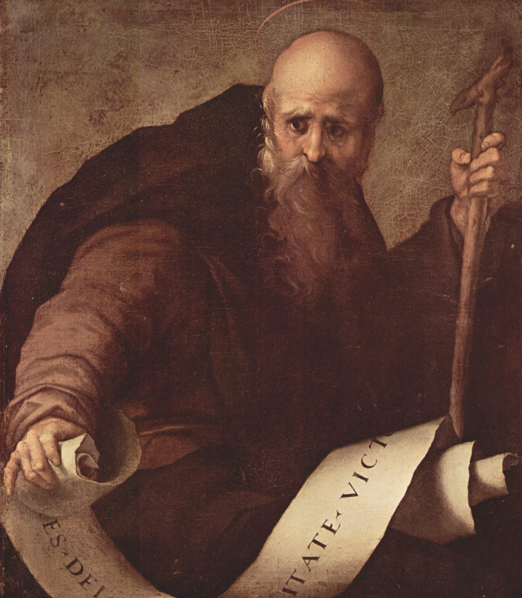
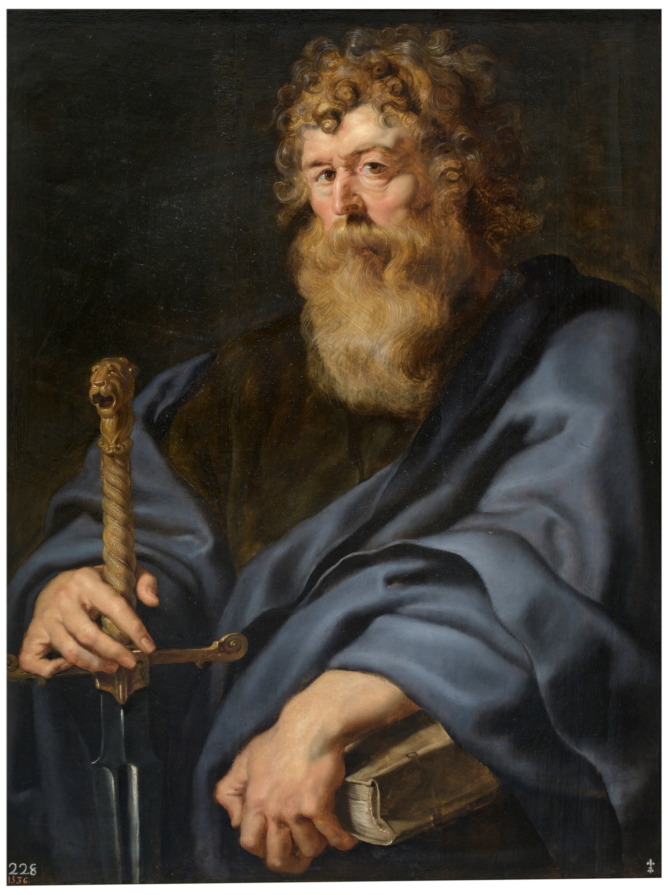

The images retrieved for the few-shot training are selected from ICONCLASS with the following choosen:

## 11H(ANTONY ABBOT)

Available at [Wikipedia](https://it.m.wikipedia.org/wiki/File:Jacopo_Pontormo_041.jpg).

## 11H(JOSEPH)

Available at [Wikipedia](https://it.m.wikipedia.org/wiki/File:Guido_Reni_-_St_Joseph_with_the_Infant_Jesus_-_WGA19304.jpg)

## 11H(PAUL)

Available at [Wikipedia](https://en.m.wikipedia.org/wiki/File:Rubens_apostel_paulus_grt.jpg)

## 11H(Francis)

## 11H(PETER)
