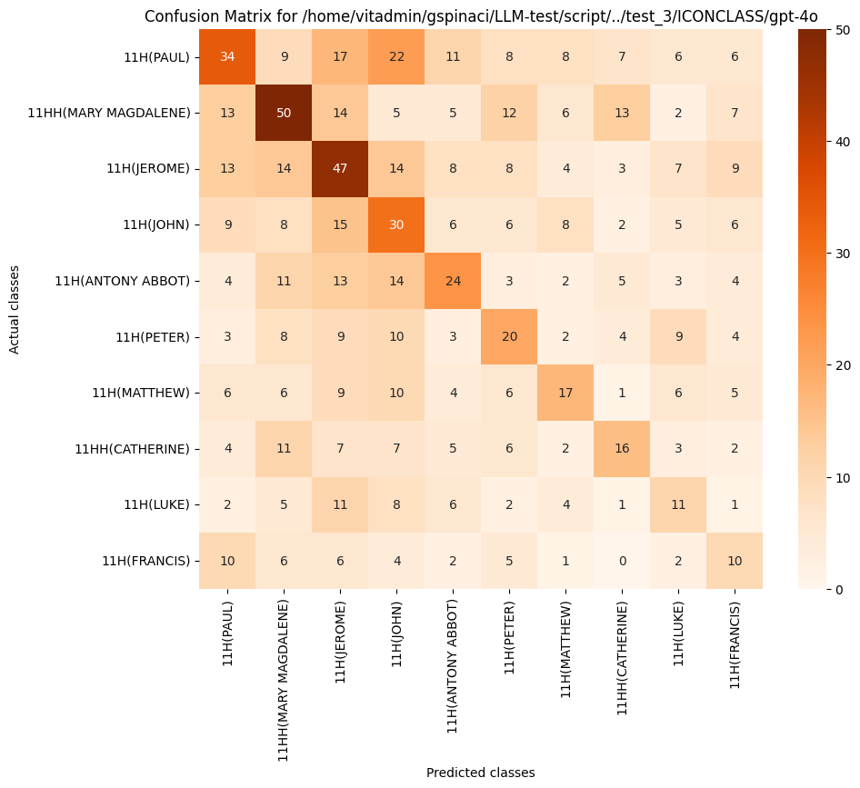
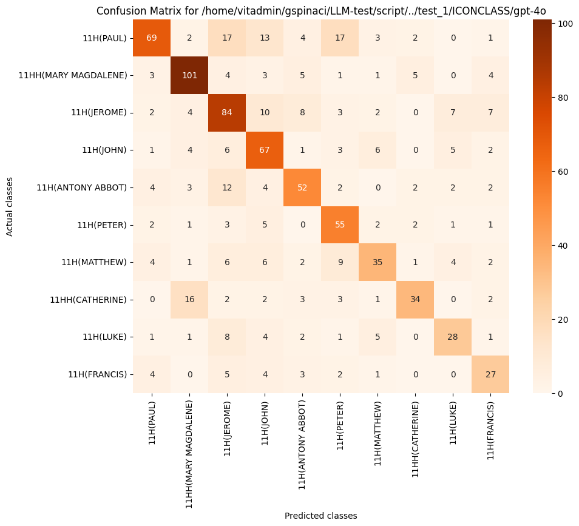

## Explaining findings

* Gemini-2.5 Pro achieved the highest performance in many configurations, confirming the strength of unified multimodal transformer architectures for image understanding.
* For contrastive models, SigLIP, consistently outperforms CLIP and is especially strong on Wikidata, a noisier and less-structured dataset
* Zero-shot with descriptions typically improved accuracy over label-only conditions, especially for contrastive models (e.g., CLIP-ViT-L/14 saw large gains on ICONCLASS)
* Few-shot improvements were inconsistent. In some cases (e.g., GPT-4o on ICONCLASS), performance decreased, showing it sensitive to prompt formatting and class imbalance.
* LLMs have betters results for Zero Shot classification with labels only, while constrastive models are balanced even when labels are noisy (descriptions)
* Wikidata is unstructured. It may have been used for training but it has a huge amount of metadata, maybe Iconclass classes weights are diluited

### GPT 4o, Few Shot on ICONCLASS

**Confusion matrix GPT 4o, ICONCLASS, Few Shot Classification**

**Confusion matrix GPT 4o, ICONCLASS, Zero Shot, label classification**

I will describe these two matrixes of GPT 4o with these points.

11H (Mary Magdalene)
*	Zero-shot: Strongly predicted (101 correct), low confusion.
*	Few-shot: Drops to 50 correct; higher misclassification with Francis (7), Paul (13), and Catherine (13).
*	Interpretation: Few-shot prompt may have introduced ambiguity or token-level confusion between feminine saints.

* It’s possible that including 5 visual-text examples disrupted attention weights, weakening semantic grounding. 
* The model may over-associate features from few-shot exemplars with broader classes (especially for Paul and Jerome)

**Results are in line with other experiments?**

**Demonstrate my findings contribute to knowledge**

**implication of the findings**

**Limitations**

**Negative findings**

