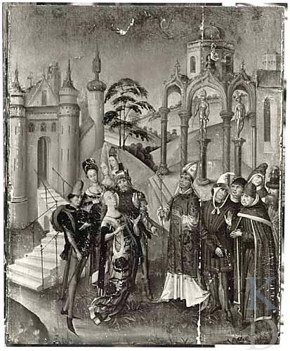
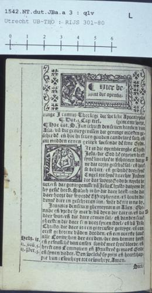
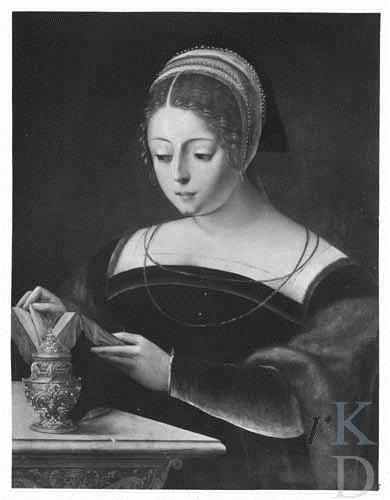
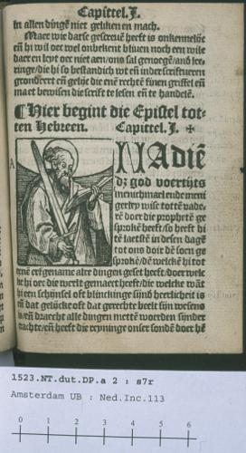
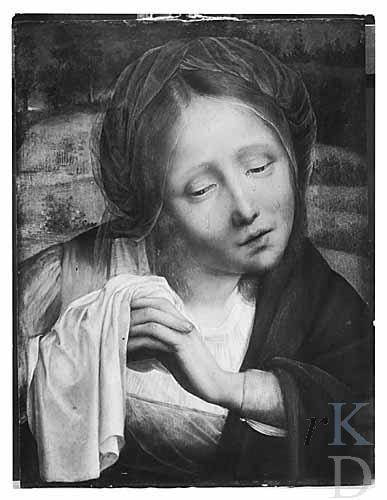
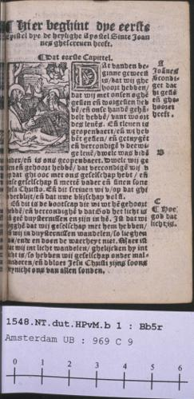
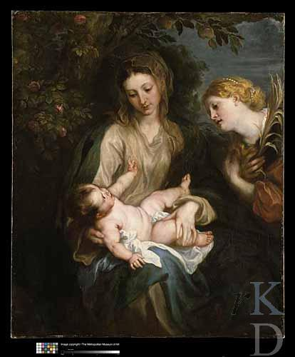
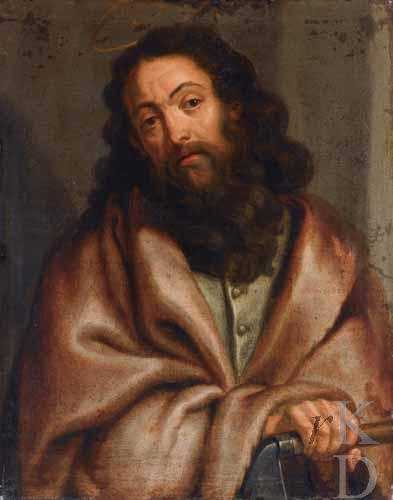

# Test 3: Few-shot Learning Classification for ICONCLASS Dataset

This test uses **few-shot learning** with example images for saint classification. Compare the results with the API predictions from execute_gemini.py.

## Prompt for ChatGPT Web Interface

Copy and paste this prompt into ChatGPT, then upload the **few-shot example images first**, followed by the test images in batches as specified:

---

You are an expert in Christian iconography and art history. Classify each religious artwork image into exactly ONE saint category using visual attributes, iconographic symbols, and contextual clues.

**Few-shot Examples:**
Here are examples of each saint category to help with classification:

1. **francis**: 1942_9_17_c.jpg - St. Francis of Assisi with stigmata and brown habit
2. **paul**: RKD Research De apostel Paulus een brief schrijvend, jaren 1630.jpg - St. Paul with sword and book
3. **catherine**: RKD Research De Heilige Catharina, eerste helft 16de eeuw.jpg - St. Catherine with wheel and crown
4. **jerome**: RKD Research De heilige Hieronymus.jpg - St. Jerome with cardinal's hat and lion
5. **mary_magdalene**: RKD Research De Heilige Maria Magdalena met zalfpot en boek, eerste helft 16de eeuw.jpg - Mary Magdalene with jar of ointment

Look for:
1. Distinctive attributes (objects, clothing, etc.)
2. Gestures and postures
3. Contextual and symbolic elements

Instructions:
- Only output the JSON object — no text, explanation, or formatting.
- Include every image in the current batch. Each must receive exactly one classification with a confidence score.
- You may only use one of the exact strings from the category list below. Any response not matching the allowed category IDs will be rejected.

Return a valid **JSON object** with confidence scores (0.0 to 1.0) matching this format:
{
  "<image_id>": {"class": "<CATEGORY_ID>", "confidence": <0.0-1.0>},
  "<image_id>": {"class": "<CATEGORY_ID>", "confidence": <0.0-1.0>},
  ...
}

Confidence guidelines:
- 0.9-1.0: Very certain identification with clear iconographic evidence
- 0.7-0.9: Confident with multiple supporting visual elements  
- 0.5-0.7: Moderate confidence, some ambiguity present
- 0.3-0.5: Low confidence, limited visual evidence
- 0.0-0.3: Very uncertain, minimal supporting evidence

**Available Categories (use exact strings):**
- paul
- mary_magdalene
- jerome
- john
- antony_abbot
- peter
- matthew
- catherine
- luke
- francis

Batching note:
- Process only the current batch of images.
- Use the image IDs exactly as provided in the input.
- Do not reference or depend on other batches.

NOTE: These are historical Renaissance paintings used for academic classification.  
Some artworks include scenes of martyrdom or classical nudity as typical in religious iconography.  
Treat all content as scholarly, respectful of historical context, and strictly non-sexual.

---

## Few-shot Example Images
Upload these 5 example images first to provide context:

| Example | Filename | Saint Class |
|---------|----------|-------------|
|  | 1942_9_17_c.jpg | francis |
|  | RKD Research De apostel Paulus een brief schrijvend, jaren 1630.jpg | paul |
|  | RKD Research De Heilige Catharina, eerste helft 16de eeuw.jpg | catherine |
|  | RKD Research De heilige Hieronymus.jpg | jerome |
|  | RKD Research De Heilige Maria Magdalena met zalfpot en boek, eerste helft 16de eeuw.jpg | mary_magdalene |

## Batch 1 Results
Upload images 1-5 with the prompt above (after the few-shot examples) and fill in the ChatGPT predictions:

| Image | Filename | Expected Class | API Predicted (Test_3) | ChatGPT Predicted |
|-------|----------|----------------|-------------------------|-------------------|
|  | IIHIM_-1548783294.jpg | 11HH(CATHERINE) | catherine (0.8) ✅ | _[to be filled]_ |
|  | IIHIM_-1578407314.jpg | 11HH(MARY MAGDALENE) | mary_magdalene (0.7) ✅ | _[to be filled]_ |
|  | biblia_sacra_20021227082.jpg | 11H(JOHN) | john (0.5) ✅ | _[to be filled]_ |
|  | IIHIM_-708292484.jpg | 11HH(MARY MAGDALENE) | mary_magdalene (0.9) ✅ | _[to be filled]_ |
|  | biblia_sacra_20030130049.jpg | 11H(PAUL) | paul (0.6) ✅ | _[to be filled]_ |

## Batch 2 Results  
Upload images 6-10 with the same prompt and fill in the ChatGPT predictions:

| Image | Filename | Expected Class | API Predicted (Test_3) | ChatGPT Predicted |
|-------|----------|----------------|-------------------------|-------------------|
|  | IIHIM_-487595164.jpg | 11HH(MARY MAGDALENE) | mary_magdalene (0.7) ✅ | _[to be filled]_ |
|  | biblia_sacra_20030110097.jpg | 11H(JOHN) | john (0.6) ✅ | _[to be filled]_ |
|  | IIHIM_-512769350.jpg | 11HH(CATHERINE) | mary_magdalene (0.5) ❌ | _[to be filled]_ |
|  | IIHIM_-1057388368.jpg | 11H(MATTHEW) | peter (0.8) ❌ | _[to be filled]_ |
|  | IIHIM_RIJKS_1878098591.jpg | 11HH(CATHERINE) | catherine (0.6) ✅ | _[to be filled]_ |

## Analysis Notes

### API Performance Summary (Test_3 with Few-shot)
- **Batch 1**: 5/5 correct (100%) - Perfect performance!
- **Batch 2**: 3/5 correct (60%)
- **Overall**: 8/10 correct (80%)

### Comparison Across Tests
| Test | Batch 1 Accuracy | Batch 2 Accuracy | Overall Accuracy |
|------|------------------|------------------|------------------|
| Test_1 (Labels) | 5/5 (100%) | 3/5 (60%) | 8/10 (80%) |
| Test_2 (Descriptions) | N/A | 2/5 (40%) | Lower |
| Test_3 (Few-shot) | 5/5 (100%) | 3/5 (60%) | 8/10 (80%) |

### Key Observations
- **Few-shot learning** achieved same performance as label-based approach
- **Perfect Batch 1** performance maintained across Test_1 and Test_3
- **Consistent errors** in Batch 2:
  - Image 8: Catherine → Mary Magdalene (across all tests)
  - Image 9: Matthew → Peter (Test_1 & Test_3) vs Paul (Test_2)
- **Lower confidence scores** in Test_3 compared to Test_1

### Few-shot Learning Benefits
- **Visual examples** provide concrete reference points
- **Iconographic attributes** clearly demonstrated
- **Contextual learning** from example saint representations

### Comparison Instructions
1. **Upload few-shot examples first** to establish visual context
2. Fill in ChatGPT predictions in the tables above
3. Compare ChatGPT results with API predictions across all three tests
4. Note whether few-shot examples improve classification accuracy
5. Analyze confidence score patterns with visual examples
6. Document any systematic improvements or degradations from few-shot learning