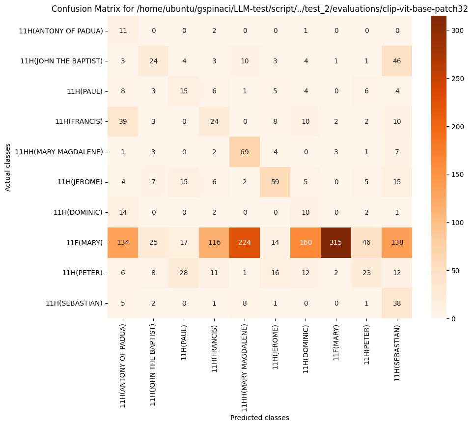
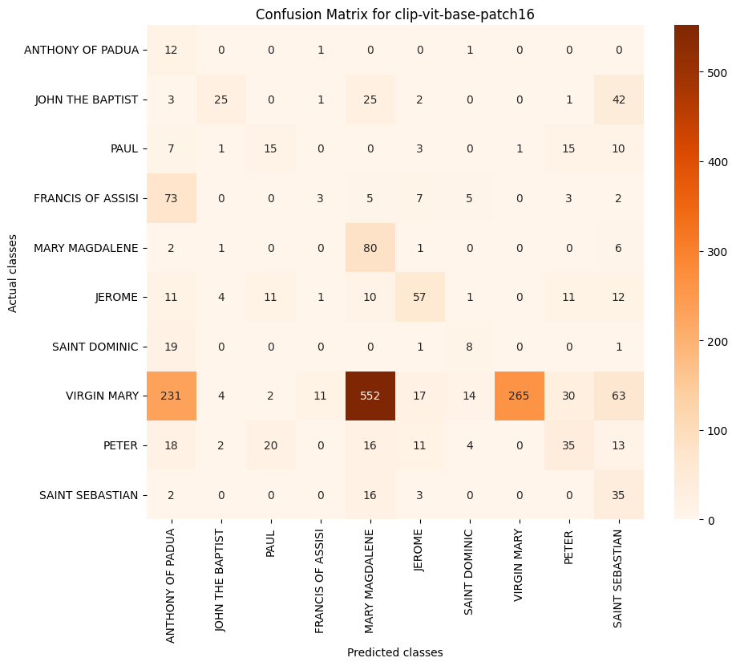
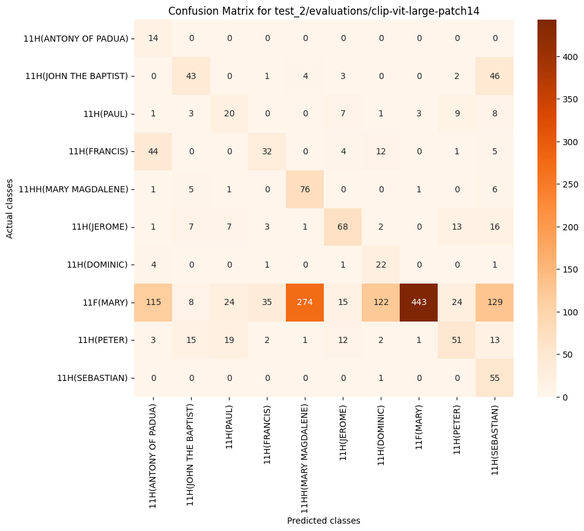
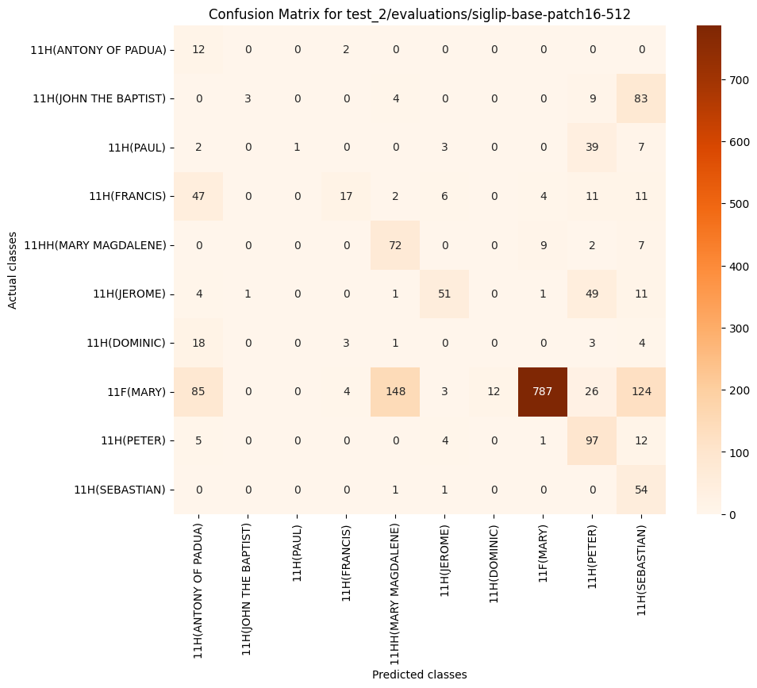
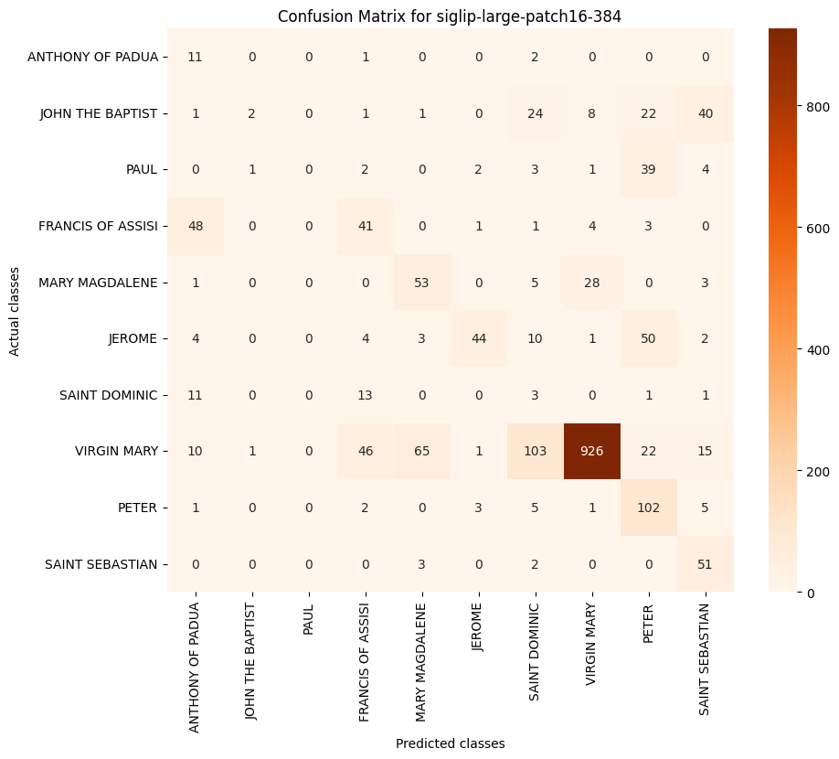

## Evaluations

### Test 2: Descriptions

| Model   | Transf. Size | Patch Size | Resolution | ANTHONY OF PADUA | FRANCIS OF ASSISI | JEROME | JOHN THE BAPTIST | MARY MAGDALENE | PAUL   | PETER  | SAINT DOMINIC | SAINT SEBASTIAN | VIRGIN MARY |
|---------|--------------|------------|------------|------------------|-------------------|--------|------------------|----------------|--------|--------|---------------|-----------------|-------------|
| CLIP    | base         | 16         | -          | 6.12%           | 5.22%            | 51.82% | 36.76%           | 20.15%         | 30.00% | 32.71% | 25.81%        | 29.17%          | 36.43%      |
| CLIP    | base         | 32         | -          | 9.32%           | 17.65%           | 51.75% | 27.75%           | 33.50%         | 22.56% | 22.33% | 8.44%         | 23.24%          | 41.32%      |
| CLIP    | large        | 14         | -          | 14.21%          | 37.21%           | 59.65% | 47.78%           | 34.08%         | 32.52% | 46.58% | 23.04%        | 32.84%          | 54.12%      |
| SIGLIP  | base         | 16         | 512        | 12.83%          | 27.42%           | 54.84% | 5.83%            | 45.14%         | 3.77%  | 54.65% | 0.00%         | 29.27%          | 79.06%      |
| SIGLIP  | large        | 16         | 384        | 21.78%          | 39.42%           | 52.07% | 3.88%            | 49.30%         | 0.00%  | 56.98% | 3.21%         | 57.63%          | 85.82%      |
| SIGLIP  | so400m       | 14         | 384        | 13.79%          | 2.74%            | 64.21% | 68.42%           | 27.06%         | 7.27%  | 63.32% | 3.57%         | 47.62%          | 63.97%      |

**Table 1.** F1 scores per class

| Model   | Transf. Size | Patch Size | Resolution | mAP (Macro) | mAP (Micro) |
|---------|--------------|------------|------------|-------------|-------------|
| CLIP    | base         | 16         | -          | 42.29%      | 28.40%      |
| CLIP    | base         | 32         | -          | 36.41%      | 31.76%      |
| CLIP    | large        | 14         | -          | 54.74%      | 44.17%      |
| SIGLIP  | base         | 16         | 512        | 42.47%      | 42.34%      |
| SIGLIP  | large        | 16         | 384        | 49.57%      | 50.59%      |
| SIGLIP  | so400m       | 14         | 384        | 53.81%      | 42.15%      |

**Table 2.** mAP Micro and Macro per model

#### CLIP-ViT-BASE-PATCH32

| Index | Class Name        | # of Images | Precision | Recall   | F1 Score | Average Precision |
|-------|-------------------|-------------|-----------|----------|----------|-------------------|
| 0     | ANTHONY OF PADUA  | 14          | 4.95%     | 78.57%   | 9.32%    | 22.20%            |
| 1     | FRANCIS OF ASSISI | 98          | 13.79%    | 24.49%   | 17.65%   | 19.30%            |
| 2     | JEROME            | 118         | 53.64%    | 50.00%   | 51.75%   | 60.01%            |
| 3     | JOHN THE BAPTIST  | 99          | 32.43%    | 24.24%   | 27.75%   | 26.27%            |
| 4     | MARY MAGDALENE    | 90          | 21.52%    | 75.56%   | 33.50%   | 53.72%            |
| 5     | PAUL              | 52          | 18.52%    | 28.85%   | 22.56%   | 15.30%            |
| 6     | PETER             | 119         | 26.44%    | 19.33%   | 22.33%   | 23.09%            |
| 7     | SAINT DOMINIC     | 29          | 4.81%     | 34.48%   | 8.44%    | 13.68%            |
| 8     | SAINT SEBASTIAN   | 56          | 14.02%    | 67.86%   | 23.24%   | 37.56%            |
| 9     | VIRGIN MARY       | 1,189       | 97.20%    | 26.24%   | 41.32%   | 92.97%            |
| 10    | Mean              | -           | 28.73%    | 42.96%   | 25.79%   | 36.41%            |

#### CLIP-ViT-BASE-PATCH16

| Index | Class Name        | # of Images | Precision | Recall   | F1 Score | Average Precision |
|-------|-------------------|-------------|-----------|----------|----------|-------------------|
| 0     | ANTHONY OF PADUA  | 14          | 3.17%     | 85.71%   | 6.12%    | 9.77%             |
| 1     | FRANCIS OF ASSISI | 98          | 17.65%    | 3.06%    | 5.22%    | 20.45%            |
| 2     | JEROME            | 118         | 55.88%    | 48.31%   | 51.82%   | 50.84%            |
| 3     | JOHN THE BAPTIST  | 99          | 67.57%    | 25.25%   | 36.76%   | 55.46%            |
| 4     | MARY MAGDALENE    | 90          | 11.36%    | 88.89%   | 20.15%   | 58.83%            |
| 5     | PAUL              | 52          | 31.25%    | 28.85%   | 30.00%   | 27.22%            |
| 6     | PETER             | 119         | 36.84%    | 29.41%   | 32.71%   | 34.66%            |
| 7     | SAINT DOMINIC     | 29          | 24.24%    | 27.59%   | 25.81%   | 24.88%            |
| 8     | SAINT SEBASTIAN   | 56          | 19.02%    | 62.50%   | 29.17%   | 45.13%            |
| 9     | VIRGIN MARY       | 1,189       | 99.62%    | 22.29%   | 36.43%   | 95.66%            |
| 10    | Mean              | -           | 36.66%    | 42.19%   | 27.42%   | 42.29%            |

#### CLIP-ViT-LARGE-PATCH14

| Index | Class Name        | # of Images | Precision | Recall   | F1 Score | Average Precision |
|-------|-------------------|-------------|-----------|----------|----------|-------------------|
| 0     | ANTHONY OF PADUA  | 14          | 7.65%     | 100.00%  | 14.21%   | 35.54%            |
| 1     | FRANCIS OF ASSISI | 98          | 43.24%    | 32.65%   | 37.21%   | 40.55%            |
| 2     | JEROME            | 118         | 61.82%    | 57.63%   | 59.65%   | 65.18%            |
| 3     | JOHN THE BAPTIST  | 99          | 53.09%    | 43.43%   | 47.78%   | 60.17%            |
| 4     | MARY MAGDALENE    | 90          | 21.35%    | 84.44%   | 34.08%   | 63.01%            |
| 5     | PAUL              | 52          | 28.17%    | 38.46%   | 32.52%   | 35.21%            |
| 6     | PETER             | 119         | 51.00%    | 42.86%   | 46.58%   | 48.53%            |
| 7     | SAINT DOMINIC     | 29          | 13.58%    | 75.86%   | 23.04%   | 28.75%            |
| 8     | SAINT SEBASTIAN   | 56          | 19.71%    | 98.21%   | 32.84%   | 73.48%            |
| 9     | VIRGIN MARY       | 1,189       | 98.88%    | 37.26%   | 54.12%   | 97.01%            |
| 10    | Mean              | -           | 39.85%    | 61.08%   | 38.20%   | 54.74%            |

#### SIGLIP-BASE-PATCH16-512

| Index | Class Name        | # of Images | Precision | Recall   | F1 Score | Average Precision |
|-------|-------------------|-------------|-----------|----------|----------|-------------------|
| 0     | ANTHONY OF PADUA  | 14          | 6.94%     | 85.71%   | 12.83%   | 33.13%            |
| 1     | FRANCIS OF ASSISI | 98          | 65.38%    | 17.35%   | 27.42%   | 42.86%            |
| 2     | JEROME            | 118         | 75.00%    | 43.22%   | 54.84%   | 34.37%            |
| 3     | JOHN THE BAPTIST  | 99          | 75.00%    | 3.03%    | 5.83%    | 39.72%            |
| 4     | MARY MAGDALENE    | 90          | 31.44%    | 80.00%   | 45.14%   | 41.60%            |
| 5     | PAUL              | 52          | 100.00%   | 1.92%    | 3.77%    | 31.66%            |
| 6     | PETER             | 119         | 41.10%    | 81.51%   | 54.65%   | 55.06%            |
| 7     | SAINT DOMINIC     | 29          | 0.00%     | 0.00%    | 0.00%    | 18.53%            |
| 8     | SAINT SEBASTIAN   | 56          | 17.25%    | 96.43%   | 29.27%   | 34.49%            |
| 9     | VIRGIN MARY       | 1,189       | 98.13%    | 66.19%   | 79.06%   | 93.30%            |
| 10    | Mean              | -           | 51.02%    | 47.54%   | 31.28%   | 42.47%            |

#### SIGLIP-LARGE-PATCH16-384

| Index | Class Name        | # of Images | Precision | Recall   | F1 Score | Average Precision |
|-------|-------------------|-------------|-----------|----------|----------|-------------------|
| 0     | ANTHONY OF PADUA  | 14          | 12.64%    | 78.57%   | 21.78%   | 22.88%            |
| 1     | FRANCIS OF ASSISI | 98          | 37.27%    | 41.84%   | 39.42%   | 48.91%            |
| 2     | JEROME            | 118         | 86.27%    | 37.29%   | 52.07%   | 48.14%            |
| 3     | JOHN THE BAPTIST  | 99          | 50.00%    | 2.02%    | 3.88%    | 45.58%            |
| 4     | MARY MAGDALENE    | 90          | 42.40%    | 58.89%   | 49.30%   | 39.28%            |
| 5     | PAUL              | 52          | 0.00%     | 0.00%    | 0.00%    | 35.57%            |
| 6     | PETER             | 119         | 42.68%    | 85.71%   | 56.98%   | 59.47%            |
| 7     | SAINT DOMINIC     | 29          | 1.90%     | 10.34%   | 3.21%    | 24.01%            |
| 8     | SAINT SEBASTIAN   | 56          | 42.15%    | 91.07%   | 57.63%   | 77.59%            |
| 9     | VIRGIN MARY       | 1,189       | 95.56%    | 77.88%   | 85.82%   | 94.31%            |
| 10    | Mean              | -           | 41.09%    | 48.36%   | 37.01%   | 49.57%            |

#### SIGLIP-SO400m-PATCH14-384

| Index | Class Name        | # of Images | Precision | Recall   | F1 Score | Average Precision |
|-------|-------------------|-------------|-----------|----------|----------|-------------------|
| 0     | ANTHONY OF PADUA  | 14          | 7.41%     | 100.00%  | 13.79%   | 20.31%            |
| 1     | FRANCIS OF ASSISI | 98          | 4.17%     | 2.04%    | 2.74%    | 36.71%            |
| 2     | JEROME            | 118         | 84.72%    | 51.69%   | 64.21%   | 60.04%            |
| 3     | JOHN THE BAPTIST  | 99          | 98.11%    | 52.53%   | 68.42%   | 71.55%            |
| 4     | MARY MAGDALENE    | 90          | 15.73%    | 96.67%   | 27.06%   | 45.65%            |
| 5     | PAUL              | 52          | 66.67%    | 3.85%    | 7.27%    | 38.56%            |
| 6     | PETER             | 119         | 50.50%    | 84.87%   | 63.32%   | 65.30%            |
| 7     | SAINT DOMINIC     | 29          | 3.70%     | 3.45%    | 3.57%    | 28.26%            |
| 8     | SAINT SEBASTIAN   | 56          | 32.47%    | 89.29%   | 47.62%   | 77.47%            |
| 9     | VIRGIN MARY       | 1,189       | 99.29%    | 47.18%   | 63.97%   | 94.26%            |
| 10    | Mean              | -           | 46.28%    | 53.16%   | 36.20%   | 53.81%            |

